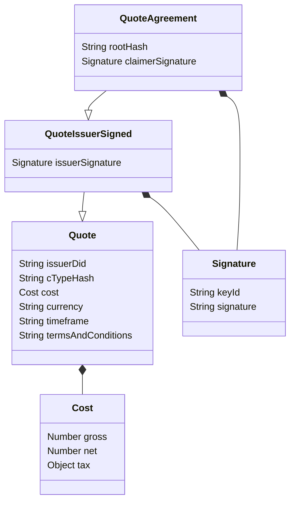

During the attestation flow, it can happen that either the Holder requests or the Issuer sends the terms of the attestation, i.e., the requirements set by the both parties (the Holder and the Issuer) for the conditions of the attestation.

These terms are defined and agreed upon before the credential is issued.
This part of the process requires interaction and communication between both parties.
This communication can be done independently, e.g., in person, via messaging, on social media etc., or via the KILT Software Development Kit (SDK).

## Defining Terms

The `Terms` object consists of following items:

- **Claim**: A partial claim with information the Issuer already has about the Holder.
  - This helps the Holder to pre-fill their claims with information only known to the Issuer.
  - The partial claim has to at least contain the CType hash the attestation will be based on.
- **CTypes**: An optional list of full CTypes, in case the Holder does not know the correct CType for the credential, yet.
- **Legitimations**: A legitimation is a credential, issued to the Issuer, showing that the Issuer has the authority or legitimacy to attest the claim requested.
  - This is a way of establishing trust between the participants.
- **Delegation Id**: An Issuer may be part of a top-down trust authority that has given them the right to attest in the name of an institution, or similar, as explained in the [Distributed Trust section](../06_distributed_trust.md). If the Issuer has attestation rights, delegated from another entity, this should be stated clearly at this point.
- **Quote**: As shown in the [section below](#defining-a-quote).

Only the CType hash in the partial claim is required, everything else is optional.

## Sending Terms

Both "request terms" and "submit terms" are part of the messaging system: the message is sent as "request terms" and received as "submit terms".

The interaction is as follows:

- The Holder creates a partial `Claim` (optionally) and sends a message to the Issuer, requesting the `Terms`.
- An Issuer creates a `Terms` object and sends it, as part of a "submit terms" message, back to the Holder.
- The Holder receives the message, checks the `Terms` and, if all is in order, agrees to them.

## Defining a Quote

A `Quote` object consists of costs, a time frame for delivering the attestation, and the terms and conditions of the work to be performed.
It may be sent to the Holder by the Issuer as part of the terms.
In cases where multiple Issuers provide the same attestation (for example, a car inspection) the Holder may request a Quote from several Issuers to choose the Issuer with the best conditions.

To come to an agreement on the Quote, the participants may message back and forth, signing the object.
If the Issuer wishes to add a Quote to their Terms, the Issuer signs the `Quote` object before sending it as part of the "submit terms" message to the Holder.
After the Holder has received the signed Quote and accepts it, the Holder counter-signs it and attaches the credential hash for linking the Quote to the credential that it refers to.
After the final exchange, the Issuer checks all the information and issues the credential.

