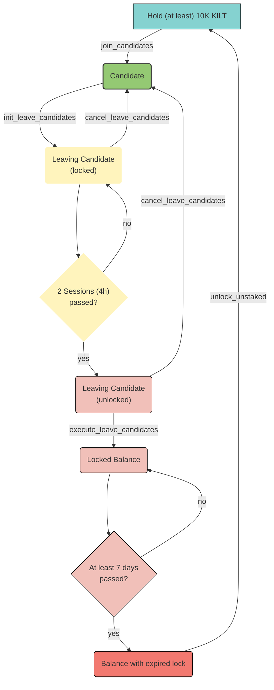

import Tabs from '@theme/Tabs';
import TabItem from '@theme/TabItem';
import StartNodeBinary from './collator/1a_start_node_binary.mdx';
import StartNodeDocker from './collator/1b_start_node_docker.mdx';

We will guide you through the steps to become a collator.
First, we will discuss the hardware requirements and how you could test the performance of your node.
Then, we go over a few configuration options and show you how to setup and start a KILT collator, including how to generate your sessions keys and join the pool of collator candidates.

## Minimum Hardware Requirements

The KILT blockchain extrinsic weights were calculated using the following hardware:

- **OS** - Ubuntu 20.04.2
- **CPU** - AMD Ryzen 7 1700X
- **Storage** - A NVMe solid-state drive. Should be reasonably sized to deal with blockchain growth. Starting around 80GB - 160GB will be okay for the first six months of KILT parachain and Kusama relaychain but it will mostly likely grow after that and will have to be re-evaluated on a regular basis.
- **Memory** - 16GB

Although the aforementioned hardware is by no means the minimum spec required, the new node *should* be at least be as capable as that in all the categories.
Having more perfoment hardware reduces the probability that the node will not be able to produce and propose a valid block on time during the allocated block production slot, missing out on the collating rewards.

You can measure the performance of the new hardware by benchmarking it using [the steps described in the benchmarking section](#benchmarking).

## Setup a Node

There are several ways to build and run a collator node.
We show both how to use a Docker image and how to compile the source code directly from [our chain repository](https://github.com/KILTprotocol/kilt-node).

There are currently two different runtimes (i.e., two different parachain environments) that a KILT collator can be part of:

- `peregrine`: the public test network whose runtime is as close to the official chain as possible. It can be used to try stuff out before executing them on the live chain, which involves spending tokens that have real monetary value.
- `spiritnet`: the official public network, which contains only stable features.

Each runtime has its own benchmark measurements.

:::info

The remainder of this guide explain how to set up and run a collator for the official **Spiritnet** parachain.
Nevertheless, we recommend to try out the setup on our Peregrine testnet first.
Hence, at each step where it is applicable, we indicate what differs between the Peregrine and Spiritnet configuration for the collator node to join either network.

:::

### Configuration

Running a collator requires a few configuration parameters.
Some of the parameters might appear twice in the command to start the collator, the reason being that a parachain collator actually runs two blockchains.
The parameter that are listed before the `--` are related to the parachain node itself (the KILT blockchain), whereas the parameters following the `--` are related to the relaychain, e.g., Kusama or Polkadot.

Following is a description of some of the parameters that can be set when spinning up a parachain collator node.

#### RPC and WS Endpoints

The collator needs session keys that connect it with the collator's KILT account.
These session keys can be generated by calling an RPC endpoint that the collator optionally exposes.
Exposing the RPC endpoint can be done using the following parameters:

```
--rpc-port=9933
--rpc-cors=all
--rpc-methods=unsafe
```

Exposing the RPC endpoint of a collator does not imply that it becomes accessible via the PolkadotJS Apps interface, because this requires a Websocket to connect to the node.

By default, the Websocket port used by the node is configured to be `9944`, but it can be changed by specifying a different value with `--ws-port=<ws_port>`.

Connecting from a remote host to either the collator RPC endpoint or WS endpoint requires to explicitly expose those endpoints to the public with the `--rpc-external` and `--ws-external` options.

:::danger

Be aware that it is highly discouraged to publicly expose an RPC endpoint, especially if it allows the execution of unsafe RPC calls!
You should be the only one able to call the RPC endpoint.
For a secure setup, follow the instructions in the section about [generating the session keys](#generating-session-keys).

:::

#### WASM runtime execution

A KILT collator should use the `--execution=wasm` parameter for both the relaychain and parachain collation.
The alternative to WASM runtime execution is native runtime execution, which might be faster but can, in some cases, deviate from the WASM execution logic and result in a different state.
When this happens, the collator will crash and will stop producing blocks.
Since the WASM runtime logic is part of the blockchain state itself and hence represents the single source of truth, all collators should execute the WASM version of the runtime logic.

#### Specify the right chain spec

The `--chain` parameter decides which blockchain the KILT collator will join.
This parameter must be specified for both the parachain and the relaychain, since both chains are, as a matter of fact, separate blockchains.
The KILT parachain accepts an additional parameter to select the environment to use for the WASM runtime execution.
This can either be `peregrine` or `spiritnet`.

Hence, to start a collator for the Spiritnet network, the parameter would be `--chain=spiritnet`, while for Peregrine would be `--chain=peregrine`.

#### Where are all the files stored?

The `--base-path` parameter specifies where all the persistent files must be stored.
By default, the session keys will also be stored in the *base path*, but we recommend to separate them from the other files.
This makes sure that the keyfiles are not accidentally lost or published when the blockchain database is either backed up or restored.
You can configure where to store the session keys using the `--keystore-path` option.
Since the collator will collate only for the parachain, there is no need to add this to the relaychain part of the command.

#### Storage Root Error

Due to an issue in the caching implementation in Substrate, it is recommended to reduce the cache size.
Otherwise the node might get blacklisted by other peers and ultimately disconnected from the p2p network.
This leads to a longer block time and a loss of rewards for the collator.

Throughout this guide, the option `--state-cache-size=1` was added to reduce the cache size to 1 Byte.

### Obtain the node executable

<Tabs
  groupId="exec-strategy"
  defaultValue="Docker"
  values={[
    {label: 'Binary', value: 'Binary'},
    {label: 'Docker', value: 'Docker'},
  ]}>
<TabItem value="Binary">

In order to build the KILT collator executable, you need to have a [nightly version of Rust](https://www.rust-lang.org/tools/install) and the `wasm32-unknown-unknown` for this toolchain installed.
We recommend to align your nightly version with the one used in the [KILT node repository](https://github.com/KILTprotocol/kilt-node) by executing the [init script](https://github.com/KILTprotocol/kilt-node/blob/develop/scripts/init.sh).
After cloning the repository, you can build the executable by running the `build` command below from the root directory.

```bash
# Clone the repository
git clone git@github.com:KILTprotocol/kilt-node.git
# Check out master branch
git checkout master
# Set up the build environment by installing the Rust compiler.
./scripts/init.sh
# Build the executable from source enabling all the optimisations with --release.
cargo build --release -p kilt-parachain
```

:::info

We discourage to use the default `develop` branch to build the executable.
Instead, the latest commit from `master` should be used.

:::

The compiled executable can be found in `./target/release/kilt-parachain` after the build process completes successfully.

</TabItem>
<TabItem value="Docker">

Simply pull the [latest docker image](https://hub.docker.com/r/kiltprotocol/kilt-node/tags):

```bash
docker pull kiltprotocol/kilt-node:latest
```

</TabItem>
</Tabs>

### Start the node

<Tabs
  groupId="exec-strategy"
  defaultValue="Docker"
  values={[
    {label: 'Binary', value: 'Binary'},
    {label: 'Docker', value: 'Docker'},
  ]}>
<TabItem value="Binary">
<StartNodeBinary />

In either case, if the node needs to be reachable via PolkadotJS Apps, the `--ws-external` flag must be added to the collator options, before the `--` divider.

</TabItem>
<TabItem value="Docker">
<StartNodeDocker />

In either case, if the node needs to be reachable via PolkadotJS Apps, the `--ws-external` flag must be added to the collator options, before the `--` divider, and the WS port must be exposed from the container with an additional `-p 9944:9944` parameter.

The docker command will map the database files for the relay and parachain as well as the keystore directory to `~/data` on the host system using the flag `-v $HOME/data:/data`.
That way the blockchain database files are not lost when and if the Docker container is removed and can be mounted back on next containers.

The docker container runs as an user with id 1000 and will try to access the mapped volume and the files it contains.
If the files are not owned by a user with id 1000, this will result in an error.
If that is the case, run `sudo chown -R 1000:1000 $HOME/data` to give the container access.


</TabItem>
</Tabs>

## Sync the Blockchain State

Before a collator can author blocks, the node needs to fully sync up with both the parachain and the relaychain.
Depending on the size of the blockchain states, it may take a number of hours to few days for the node to catch up.
More details can be found on the [Polkadot network docs](https://wiki.polkadot.network/docs/maintain-guides-how-to-validate-kusama#synchronize-chain-data).

## Session Keys

Once the chain has fully synced, the collator needs to set sessions keys to begin collating on the network.
To check whether the account has already set some session keys, the RPC `hasKey(publicKey, keyType)` and `hasSessionKeys(sessionKeys)` in the `author` can be called.


:::info

The session keys associate a collator node with an account on the blockchain.
They are hot keys that must be kept online.
It is recommended to change them throughout sessions.

:::

### Generate New Session Keys {#generating-session-keys}

:::warning

Make sure that no unauthorised party is able to access the RPC endpoint of the collator.
Use SSH forwarding for the RPC port when needing to perform some RPC operations on the node with 
```
ssh -L 127.0.0.1:9944:127.0.0.1:9944 <user>@<server>
```

:::

There are tree ways to create the session keys.
We recommend using the curl command on the same host that the node is running or from a host that has an active SSH tunnel with it.
This way there is no need to add the `--unsafe-rpc-external` argument to the node.
Nevertheless, the session keys can also be rotated using the PolkadotJS Apps interface or by directly storing the new key in the node's keystore.


<Tabs
  defaultValue="curl"
  values={[
    {label: 'curl', value: 'curl'},
    {label: 'Apps', value: 'apps'},
    {label: 'Subkey', value: 'subkey'},
  ]}>
<TabItem value="curl">

#### Curl command

A collator can use the following command to rotate the session key.

```bash
curl -H "Content-Type: application/json" -d '{"id":1, "jsonrpc":"2.0", "method": "author_rotateKeys", "params":[]}' http://localhost:9933
```

The answer should look like the JSON object below.
The `result` key is the HEX-encoded public part of the newly created session key.

```
{"jsonrpc":"2.0","result":"0xb2dc33b1ff0c6f8b07f882236bb992e903452791ff5225b5eb4c2c1a40252d5d","id":1}
```

</TabItem>
<TabItem value="apps">

In order to use the PolkadotJS Apps UI, the node websocket endpoint must be reachable.
This can be done either by publicly exposing it with the `--ws-external` flag, which is discouraged, or by setting up an SSH tunnel for the websocket endpoint with `ssh -L 127.0.0.1:9933:127.0.0.1:9933 <user>@<server>`.
If the latter option is chosen, there is no need to have a separate SSH tunnel for RPC traffic as all the RPC operations can be performed directly from the now accessible PolkadotJS Apps interface.


After connecting to the node, from the menu select `Developer -> RPC calls -> author -> rotateKeys()`.
This will generate a new session key which replaces the existing one.


</TabItem>
<TabItem value="subkey">

A keypair can be created using the [subkey tool](https://substrate.dev/docs/en/knowledgebase/integrate/subkey) by following the steps in the tool's official documentation.
The generated private and public keys can then be saved within the keystore folder of the collator node to be used as session keys.

```
❯ subkey generate -n kilt
Secret phrase `very secure private key you should not use the example private key` is account:
  Secret seed:      0xcafe97b4b8f0adc1adeb3feef30bf2e5b9d49ddd897f268c8027c850DeadBEEF
  Public key (hex): 0xda3861a45e0197f3ca145c2c209f9126e5053fas503e459af4255cf8011d51010
  Account ID:       0xda3861a45e0197f3ca145c2c209f9126e5053asdg03e459af4255cf8011d51010
  SS58 Address:     4srC1aowD94H9UH9xsnfv7XV6oHU6dhCymKYZHWKsdddaP29
```

The name of the file must be the *public* key prepended with `61757261` (HEX representation of `aura`) and without the `0x` prefix, while the content of the file has to be the secret phrase.


For instance, with the keypair generated in the example, the session key file would be stored at the path `./keystores/61757261da3861a45e0197f3ca145c2c209f9126e5053fas503e459af4255cf8011d51010`.

</TabItem>
</Tabs>


:::info

The rotation of the session key should be done periodically to ensure that the collator can remain secure and safe from attack.
You can find more information about session keys in the [Substrate Documentation](https://docs.substrate.io/v3/concepts/session-keys/#generation-and-use).

:::

Once a new session key is generated, the collator must then link that key to its own account in order to receive rewards for producing new blocks.
This operation is performed by submitting a signed extrinsic to the blockchain.
For Spiritnet, the endpoint is [wss://spiritnet.kilt.io](https://polkadot.js.org/apps/?rpc=wss%3A%2F%2Fspiritnet.kilt.io#/explorer), while for Peregrine is [wss://peregrine.kilt.io/parachain-public-ws](https://polkadot.js.org/apps/?rpc=wss%3A%2F%2Fperegrine-stg.kilt.io%2Fpara-public-ws#/explorer).

`Developer -> Extrinsics -> Submission`

1. Select the collator's KILT address as the extrinsic submitter (the *using the selected account* field)
2. Submit the following extrinsic: `session -> setKeys(keys, proof)`
    - `keys` -> the public session key (`0xda3861a45e0197f3ca145c2c209f9126e5053fas503e459af4255cf8011d51010` in the example above)
    - `proof` -> the proof of ownership. It can be set to `0x00`


Once the extrinsic is executed, the collator has linked the new session key to its account and can start receiving rewards for producing new blocks.
However, the new session key does not become effective immediately but with the start of the next session.

:::info

A session takes 600 blocks or around 120~ minutes

:::

## Join the collator candidates pool

:::warning

These steps should be followed only once a collator node has successfully linked a session key to its address and has synced the parachain and relaychain states by following the steps above.

:::

The maximum number of **active** collators is currently (2022-05-05) 16 on Peregrine and 30 on Spiritnet.

In order to become a collator, you must stake
- at least 10,000 KILT tokens and
- at most 200,000 KILT tokens.

The collator must call an extrinsic `parachainStaking -> joinCandidates(stake)` with the desired stake to join the candidate pool:

 In Polkadot JS ([wss://spiritnet.kilt.io](https://polkadot.js.org/apps/?rpc=wss%3A%2F%2Fspiritnet.kilt.io#/explorer), or [wss://peregrine.kilt.io/parachain-public-ws](https://polkadot.js.org/apps/?rpc=wss%3A%2F%2Fperegrine-stg.kilt.io%2Fpara-public-ws#/explorer)) go to `Developer -> Extrinsics -> Submission`

1. Select the collator's KILT address as the extrinsic submitter (the *using the selected account* field)
2. Select the following extrinsic: `parachainStaking -> joinCandidates(stake)`
3. Insert the staked KILT amount for the collator
4. Sign and submit the extrinsic

:::info

A recent change in the blockchain metadata resulted in a change in the UI regarding how balances are shown.
In the current version of PolkadotJS Apps, specifying 1 KILT requires adding 15 trailing `0`s.
So, for instance, 1 KILT needs to be written as `1000000000000000`, while 10,000 KILT would be written as `10000000000000000000`.

:::


A collator candidate can check the current top candidates to see their position and required staked amount to become an active collator, i.e., to start authoring new blocks.

 In Polkadot JS ([wss://spiritnet.kilt.io](https://polkadot.js.org/apps/?rpc=wss%3A%2F%2Fspiritnet.kilt.io#/explorer), or [wss://peregrine.kilt.io/parachain-public-ws](https://polkadot.js.org/apps/?rpc=wss%3A%2F%2Fperegrine-stg.kilt.io%2Fpara-public-ws#/explorer)) go to `Developer -> Chain state -> Storage`

1. Selected state query: `parachainStaking -> topCandidates(): ParachainStakingSetOrderedSet`
2. Execute the query by pressing the "+" button on the right side

If the collator has enough self-stake and delegator stake it will be selected to collate.
A time period of two sessions must pass before the collator will be authoring blocks, e.g.,  after the remainder of the current session and the entire next one.


### Change a Collator's Stake

A collator can increase/decrease their stake, always within the limits of the minimum and maximum allowed stake amounts.
The corresponding extrinsics for these operations are `parachainStaking -> candidateStakeMore(more)` and `parachainStaking -> candidateStakeLess(less)`.


## Monitoring

It would be ideal if the host being monitored is not the host monitoring, i.e., if the monitoring process does not run on the same host as the collator process.
However, in cases of limited resources, the two can also co-exist on the same host.

The monitoring process collects two types of metrics: **Node Exporter metrics** and **blockchain metrics**.
The monitoring infrastructure can either be run as a local grafana cluster or as a [cloud-based solution](https://grafana.com/products/cloud/).

:::info

For cloud-based solutions, the prometheus process must be publicly accessible, e.g., via a reverse proxy.

:::

### What will be installed

The docker compose setup creates and deploys up to four containers, all of which are optional:

- **Node Exporter**: collects metrics from the host machine including CPU, memory, and storage usage, and network traffic statistics
- **Prometheus**: stores the metrics collected by Node Exporter and collects additional metrics from the blockchain node
- **Grafana**: shows the collected metrics in a customisable dashboard and can be configured to send alerts when certain conditions are met
- **Collator**: the collator node itself which runs one of the available KILT runtimes

### Installation
Install the latest version of docker-compose from the [official docker-compose installation guide](https://docs.docker.com/compose/install/), then:

1. Clone the [entire KILT chain repo](https://github.com/KILTprotocol/docs) or download only the [monitoring template](https://github.com/KILTprotocol/docs/tree/master/collator).
2. Change directory to the above with ```cd docs/collator```
3. Edit the `.env` file and insert your desired grafana admin user and password
4. Depending on the installation type either:
  - run `docker-compose up -d` to install only Node Exporter and prometheus or
  - run `docker-compose up --profile grafana -d` to install Node Exporter, prometheus and grafana or
  - run `docker-compose --profile collator --profile grafana up -d` to install Node Exporter, prometheus, grafana **and** a collator node

5. Secure the endpoints:
    1. Install nginx with certbot ```sudo apt install nginx certbot python3-certbot-nginx```
    2. If ufw is enabled, allow Nginx Full: ```sudo ufw allow 'Nginx Full'```
    3. Generate an SSL certificate: ```sudo certbot --nginx -d ${DOMAIN_OF_SERVER_NAME}```
    4. Enable certificate renewal by editing the crontab list ```crontab -e``` and appending ```0 5 * * * /usr/bin/certbot renew --quiet```
    5. Reload nginx after replacing the default nginx file with prometheus endpoint (if grafana cloud is chosen) or grafana endpoint (if grafana installed) by adding the following config snippet to `/etc/nginx/sites-enabled/default`
    ```
      location / {
          proxy_pass http://localhost:9090/;    #proxy_pass http://localhost:3000/;
      }
    ```
    6. Enable basic authentication by replacing the default password in `prometheus.yml` using  ``` htpasswd -nBC 10 "" | tr -d ':\n' ```

### Testing the Configuration
The configuration can be checked by visiting `https://localhost:3000` and authenticating with the username and password set in `.env` at step 3.

### Configuring Alert Notification Channel
Choose any of the supported notification channels and follow the [grafana documentation](https://grafana.com/docs/grafana/latest/alerting/old-alerting/notifications/) to receive alerts and notifications.

Overall, for monitoring we recommend the following stack:
- Prometheus
- Grafana
- Node exporter
- Nginx

## Bootnodes

The bootnodes are required to connect to the peer to peer network and discover additional peers.
The addresses are included in the chain spec, so there is no need to add them as a parameter to the start command.
For the sake of completeness, the bootnodes are listed below:

<Tabs
  groupId="exec-network"
  defaultValue="Spiritnet"
>
<TabItem value="Spiritnet" label="Spiritnet">

  For **Spiritnet**, the parachain bootnodes are:

```
--bootnodes=/dns4/hetzner-1.kilt.io/tcp/30333/p2p/12D3KooWKU8ehzuKAzHEMCy4i4kpJtgCFBCYYhqcub4Y1HR8FRoT \
--bootnodes=/dns4/hetzner-2.kilt.io/tcp/30333/p2p/12D3KooWDJzJ7TRNKvE2DWXMSSsoKR5TgxsnNy3W1eCBPveX6g9i \
--bootnodes=/dns4/node-6840569230186737664-0.p2p.onfinality.io/tcp/11578/ws/p2p/12D3KooWQapPfoSDxLBnsVZmpRA1yNApXEAEuhexPcFa7fECqpHa \
--bootnodes=/dns4/node-6840781141641752576-0.p2p.onfinality.io/tcp/28779/ws/p2p/12D3KooWKMCaxjsvaNkYkdQGnPQnkYFouHFdJ3S36aBhV6QTXzaE \
--bootnodes=/dns4/node-6840781099853901824-0.p2p.onfinality.io/tcp/15360/ws/p2p/12D3KooWLWSE85c5PSsgo62Dy5UM68Sx8p3vnJvtvDVC8QHXFpR
```

</TabItem>
<TabItem value="Peregrine" label="Peregrine">

For **Peregrine**, the parachain bootnodes are:

```
--bootnodes=/dns4/eyrie-1.kilt.io/tcp/30371/p2p/12D3KooWALJtiCZzcUPVsCa5f5egGfQyFhPY67kKosDw95bJqK7M \
--bootnodes=/dns4/eyrie-2.kilt.io/tcp/30372/p2p/12D3KooWCRgcGtFRsvqxqgysiR6Ah9SAzUNkM12Ef9sy59ZEspSQ
```
  
</TabItem>
</Tabs>

## Lifecycle of a Collator

When you intent to stop collating or just being a collator candidate, you have to go through three stages until your staked tokens are unlocked and your collator state is purged from the chain.

First, you signal your intent by calling `init_leave_candidates`.
You will both be removed from the `CandidatePool` and your state switches from `Active` to `Leaving(leave_round)`, where `leave_round` reflects the number of sessions in which you can actually leave.
You still need to stay online and build blocks for the current and next sessions.
Of course, you will continue to receive rewards for your authored blocks.
A leaving candidate cannot be selected as an active collator for the sessions hereinafter.
Moreover, you cannot receive new Delegations and existing Delegations cannot be adjusted.
However, Delegations can still be revoked.

Second, after waiting until the `leave_round`-th session, you can call `execute_leave_candidate` to remove all of your `Candidate` associated storage.
You should be certain as there is no turning back afterwards.
If you wish to become a Candidate at a later stage, you have to apply again and miss out on all of your former delegations.

However, you can still cancel your exit request by calling `cancel_leave_candidates` if you have not exited yet and the CandidatePool is not full already.
Upon cancelling your exit intent, your state switches back to `Active` and you still have all Delegations which were not revoked in the meantime.
Moreover, if you are you are one of the top staked candidates, you will automatically become a Collator in two rounds (~4 hours).

In case you executed the exit request, you cannot immediately unlock your previously staked tokens.
There is a delay of 7 days in block time before you can free them by calling `unlock_unstaked`.



## Benchmarking (optional) {#benchmarking}

To enable benchmarking, the collator must enable the benchmarking feature from a new build of the `kilt-parachain`.

:::caution

Don't use this binary for running the collator!

:::

```bash=
cargo build --release -p kilt-parachain --features=runtime-benchmarks
```

The benchmarks can be run to compare the server's hardware capabilities against the referenced hardware.
At the moment, we have benchmarked the Spiritnet and Peregrine runtimes on an AMD Ryzen 7 1700X with 64GB RAM and an NVMe SSD.
After executing the benchmarks on a server compare the weights to the official KILT weights.
Your weight results should at least be similar to the official ones and the lower yours are, the better.

The commands executed to benchmark the KILT runtimes can be found in the official benchmark files for both [spiritnet](https://github.com/KILTprotocol/kilt-node/tree/master/runtimes/spiritnet/src/weights) and [peregrine](https://github.com/KILTprotocol/kilt-node/tree/master/runtimes/peregrine/src/weights).

Below is an example of benchmarking for the the `balances` pallet.

```bash=
./target/release/kilt-parachain \
  benchmark \
  --chain=spiritnet-dev \
  --execution=wasm \
  --wasm-execution=Compiled \
  --heap-pages=4096 \
  --extrinsic=* \
  --pallet=parachain_staking \
  --steps=50 \
  --repeat=20 \
  --output \
  ./runtimes/spiritnet/src/weights/parachain_staking.rs \
  --template \
  ./.maintain/weight-template.hbs
```

## Troubleshooting

There are a few things that can be checked to make sure everything is set up correctly.

If, from any network explorer, e.g., the one offered by PolkadotJS Apps, the collator's account is shown next to some of the blocks, then the collator is correctly producing blocks and getting rewarded for it.
If the logs print the message that starts with a :gift: emoji, it indicates that the collator setup is correct but that the blocks produced are not included by the relaychain.
This typically signals some issues about the node hardware or connectivity.
If not, it might be that the node does not produce and send blocks fast enough.
This can be caused by slow hardware or a slow internet connection.
Also, note that a high bandwidth connection can still be slow if it has a high ping!
Bandwidth and latency do not necessarily come hand in hand.
In this case, it is better to rule out other options before thinking to upgrade the collator's hardware.

1. Check that the session keys are associated with the validatorId (aka AccountId).
There should be a 32 Byte long public key stored in `session > nextKeys(your AccountId)`.
2. Check that the node has the corresponding private key for the public session key.
Connect to the node and query `author > hasKey(<pubKey from 1.>, aura)` to see if it returns `true`.
3. Check that the node is fully synced with the relaychain & parachain (best and finalised block number is equal to the one shown in the PolkadotJS Apps ([wss://spiritnet.kilt.io](https://polkadot.js.org/apps/?rpc=wss%3A%2F%2Fspiritnet.kilt.io#/explorer), [wss://peregrine.kilt.io/parachain-public-ws](https://polkadot.js.org/apps/?rpc=wss%3A%2F%2Fperegrine-stg.kilt.io%2Fpara-public-ws#/explorer)) and on Subscan ([Spiritnet](https://spiritnet.subscan.io/), [Peregrine](https://kilt-testnet.subscan.io/)).
4. Check that the collator is among the selected candidates.
Its address should included in the list returned by querying `parachainStaking > topCandidates()`.
5. Check that the `parachainStaking` pallet has registered the collator's address among the authorised authors in the `session`.
Its address should be listed when querying `session > validators()`.
