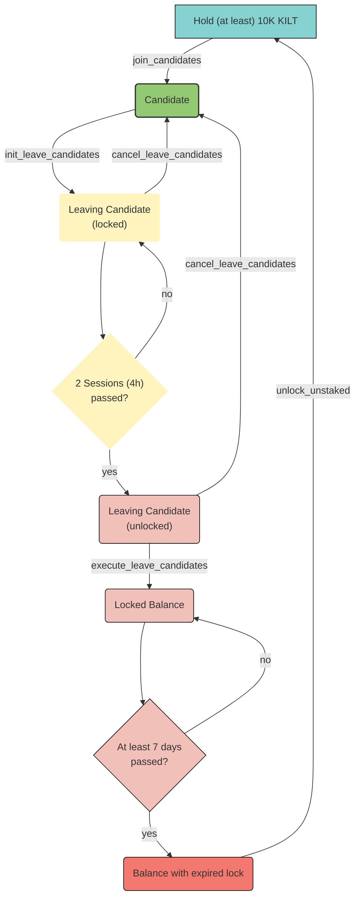

## Lifecycle of a Collator

When you intent to stop collating or just being a collator candidate, you have to go through three stages until your staked tokens are unlocked and your collator state is purged from the chain.

First, you signal your intent by calling `init_leave_candidates`.
You will both be removed from the `CandidatePool` and your state switches from `Active` to `Leaving(leave_round)`, where `leave_round` reflects the number of sessions in which you can actually leave.
You still need to stay online and build blocks for the current and next sessions.
Of course, you will continue to receive rewards for your authored blocks.
A leaving candidate cannot be selected as an active collator for the sessions hereinafter.
Moreover, you cannot receive new Delegations and existing Delegations cannot be adjusted.
However, Delegations can still be revoked.

Second, after waiting until the `leave_round`-th session, you can call `execute_leave_candidate` to remove all of your `Candidate` associated storage.
You should be certain as there is no turning back afterwards.
If you wish to become a Candidate at a later stage, you have to apply again and miss out on all of your former delegations.

However, you can still cancel your exit request by calling `cancel_leave_candidates` if you have not exited yet and the CandidatePool is not full already.
Upon cancelling your exit intent, your state switches back to `Active` and you still have all Delegations which were not revoked in the meantime.
Moreover, if you are you are one of the top staked candidates, you will automatically become a Collator in two rounds (~4 hours).

In case you executed the exit request, you cannot immediately unlock your previously staked tokens.
There is a delay of 7 days in block time before you can free them by calling `unlock_unstaked`.

