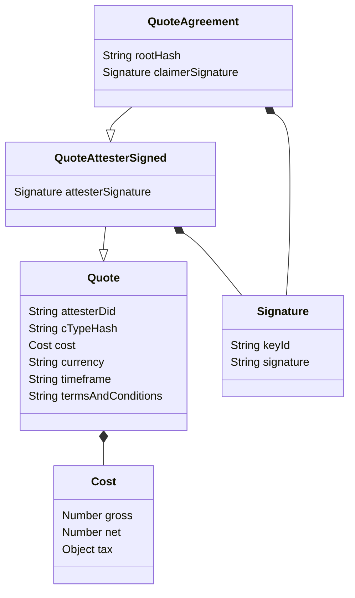

The Claimer may request and / or the Attester may send the Terms of the attestation, i.e., the requirements set by the participants (the Claimer and the Attester) for the conditions of the attestation.

These Terms are defined and agreed upon before the attestation is created. This part of the process requires interaction and communication between both parties. This communication can be done independently, e.g. in person, via messaging, on social media etc., or via the KILT software development kit (SDK).

## Sending Terms

Both “request terms” and “submit terms” are part of the messaging system: the message is sent as “request terms” and received as “submit terms”.

The interaction is as follows:

- The Claimer creates a partial `Claim` (optionally) and sends a message to the Attester, requesting the Terms
- An Attester creates a `Terms` object and sends it, as part of a "submit terms" message, back to the Claimer.
- The Claimer receives the message, checks the Terms and, if all is in order, agrees to them

## How to create a Terms object

The Terms object consists of following items:

- **Claim**: A partial claim with information the attester already has about the claimer. This helps the claimer to pre-fill their claims with information only known to the attester.
  - The partial claim has to at least contain the ctype hash the attestation will be based on.

- **CTypes**: An optional list of full ctypes, in case the claimer doesn't know about the correct ctype for the credential, yet.

- **Legitimations**: Legitimations are Credentials, issued to the Attester, showing that the Attester has the authority or legitimacy to attest the claim requested. This is a way of establishing trust between the participants.

- **Delegation Id**: An Attester may be part of a top-down trust authority, given them the right to attest in the name of an institution, or similar. E.g. a business giving the right to their employee to attest the claim on their behalf. This is a delegation. If the Attester has attestation rights, delegated from another entity, this should be stated clearly at this point. See [here](/docs/concepts/distributed_trust) for details on how to create a delegation.

- **Quote**: A Quote could include any or all of the following:

  - The time frame the claim will be completed in
  - The public address of the Attester completing the attestation
  - The hash of the corresponding CType
  - A breakdown of all the (net and gross) costs, the currency quoted, and any taxes associated with the attestation.
  - A link to the terms and conditions of the attestation.

Only the ctype hash in the partial claim is required, everything else is optional.

## How to create a Quote

A Quote consists of costs, a time frame until the attestation will be delivered and the terms and conditions of the work to be performed. It may be sent to the Claimer by the Attester as part of the Terms. In cases where multiple Attesters provide the same attestation (for example, a car inspection) the Claimer may request a Quote from several Attesters to choose the Attester with the best conditions.

To come to an agreement on the Quote, the participants may message back and forth, signing the object.

If the Attester wishes to add a Quote to their Terms, the Attester signs the `Quote` object before sending it as part of the "submit terms" message to the Claimer.

After the Claimer has received the signed Quote and accepts it, the Claimer will sign it on their side, too and attaches the credential hash of the `Request for Attestation` object for referencing the Credential, the Quote should be applied to.

## Agreeing to Terms and Quote

If the Claimer agrees to the `Terms`, they include the information for it in the `Request for Attestation` object.
If the Attester has sent a Quote as part of the Terms, the Claimer must also sign and agree to the Quote, by signing it.

The request and the signed Quote are than sent to the Attester.

After the final exchange, the Attester checks all the information and attests the `Claim`.
