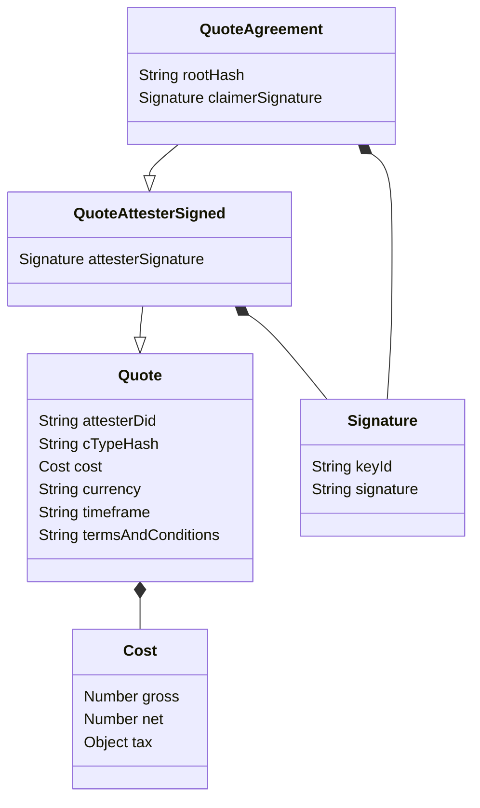

During the attestation flow, it can happen that either the Claimer requests or the Attester sends the Terms of the Attestation, i.e., the requirements set by the both parties (the Claimer and the Attester) for the conditions of the Attestation.

These Terms are defined and agreed upon before the Credential is issued.
This part of the process requires interaction and communication between both parties.
This communication can be done independently, e.g., in person, via messaging, on social media etc., or via the KILT Software Development Kit (SDK).

## Defining Terms

The `Terms` object consists of following items:

- **Claim**: A partial Claim with information the Attester already has about the Claimer.
  - This helps the Claimer to pre-fill their Claims with information only known to the Attester.
  - The partial Claim has to at least contain the CType hash the Attestation will be based on.
- **CTypes**: An optional list of full CTypes, in case the Claimer does not know about the correct CType for the credential, yet.
- **Legitimations**: A legitimation is a Credential, issued to the Attester, showing that the Attester has the authority or legitimacy to attest the Claim requested.
  - This is a way of establishing trust between the participants.
- **Delegation Id**: An Attester may be part of a top-down trust authority, given them the right to attest in the name of an institution, or similar, as explained in the [Distributed Trust section](../05_distributed_trust.md). If the Attester has attestation rights, delegated from another entity, this should be stated clearly at this point.
- **Quote**: As shown in the [section below](#defining-a-quote).

Only the CType hash in the partial Claim is required, everything else is optional.

## Sending Terms

Both "request terms" and "submit terms" are part of the messaging system: the message is sent as "request terms" and received as "submit terms".

The interaction is as follows:

- The Claimer creates a partial `Claim` (optionally) and sends a message to the Attester, requesting the `Terms`.
- An Attester creates a `Terms` object and sends it, as part of a "submit terms" message, back to the Claimer.
- The Claimer receives the message, checks the `Terms` and, if all is in order, agrees to them.

## Defining a Quote

A `Quote` object consists of costs, a time frame until the Attestation will be delivered and the terms and conditions of the work to be performed.
It may be sent to the Claimer by the Attester as part of the Terms.
In cases where multiple Attesters provide the same Attestation (for example, a car inspection) the Claimer may request a Quote from several Attesters to choose the Attester with the best conditions.

To come to an agreement on the Quote, the participants may message back and forth, signing the object.
If the Attester wishes to add a Quote to their Terms, the Attester signs the `Quote` object before sending it as part of the "submit terms" message to the Claimer.
After the Claimer has received the signed Quote and accepts it, the Claimer counter-signs it and attaches the credential credential hash for linking the Quote the Credential that it refers to.
After the final exchange, the Attester checks all the information and issues the Credential.

