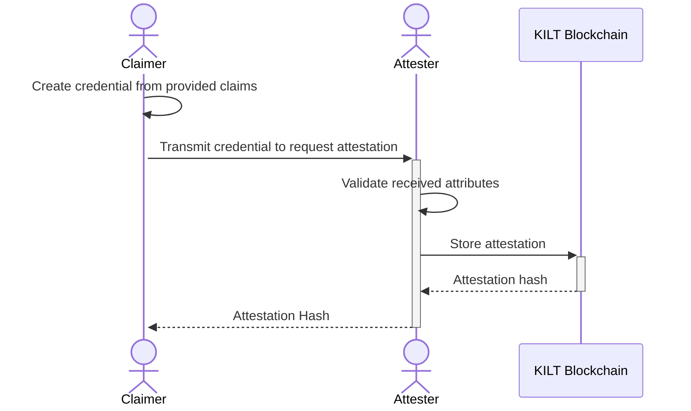
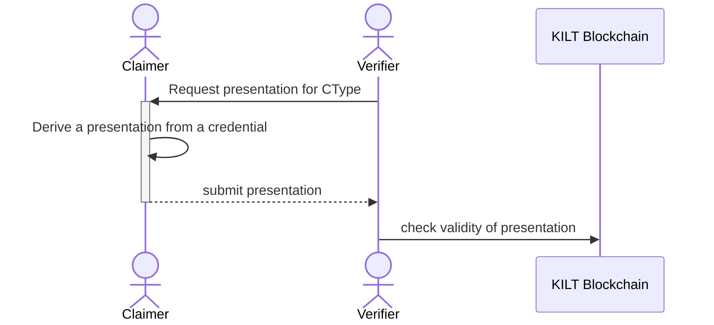

This tutorial runs through the full story of a claim.

It involves three actors, which work together to create **distributed trust**:

-   A Claimer is an actor that claims to posses certain credentials, abilities, or other attributes.
-   An Attester is an actor that verifies the claims of a Claimer.
-   A Verifier is an actor that asks for proof of a claim.

For the workshop you'll play all three roles.

In a real world use case, these actors would be different people and services, which this workshop simulates by using different folders for each service.
Each actor typically performs different roles:

-   Both the Verifier and the Attester have to interact with the KILT blockchain.
-   But only the Attester is required to own KILTs since they have to pay for storing the attestation on chain.
-   The Verifier only needs to query the KILT blockchain to ensure that the attestation is still valid and was not revoked.
-   The Claimer is not required to query the blockchain, but they might do so to check whether their credential is still valid or if the Attester has revoked it in the meantime.

## Request an Attestation

Before the Claimer can attest a credential, they need to generate a [light DID](../01_sdk/02_cookbook/01_dids/01_light_did_creation.md), which can happen off-chain.

The Attester has to register their DID on chain and needs KILT coins.

After both the Attester and the Claimer have set up their identities, the Claimer can start the attestation process by requesting an attestation from the Attester.

1. The Claimer prepares the Credential to attest, along with some proof, for example, a bank statement and ID.
2. They send the document to the Attester for attestation.
3. Upon receiving the credential, the Attester decides whether the claim is valid by examining the proofs. If the Attester trusts the claim, they store the attestation document's hash value on the chain, which is a non-functional copy of the document.
4. The Attester sends this hash value to the Claimer, which represents verification of a document.

## Verify an Attestation

The Verifier requests a presentation from the Claimer for a specific required CType. Without a specific CType, the presentation is meaningless.

<!-- TODO: Find out more link… -->

A presentation is derived from a credential and does not need to contain all attributes.

After the request, the Claimer can choose to hide elements of their credentials that aren't relevant to the claim. For example, hide their address from their ID if the Verifier is only interested in their age.

:::info

A later step in the workshop [explains CTypes in more detail](./04_attester/03_ctype.md).

:::

### Example: Requesting a travel visa

To take an example of applying for a travel visa:

1. The Embassy (analogous to the Verifier) asks a traveler (analogous to the Claimer), for a specific document or CType. For example, it could be a bank statement. The Embassy asks, "Provide proof of financial stability, and we'll grant you a visa." The traveller gets the bank statement from their bank, gets it attested by the bank (The Attester), and prepares the document.
2. The document is ready, but the Embassy doesn't need all the information in the document. The embassy wants to know if a traveller has sufficient funds, but they don't need to know any transaction details. So, the traveller redacts or hides these details while presenting.
3. The traveller presents the document to the embassy.
4. The embassy verified the document's authenticity by comparing its hash value with the one on their internal system or a decentralized ledger.
5. Since they trust the Attester (in this case, the bank that attested the bank statement), they approved the visa application.

:::tip Summary

As you can see, the Embassy didn't need to trust the Claimer directly in this system. They trusted the Attester, whom they had previously worked with or respected due to their position. And with that trust, they granted the visa.

Even though this process emerged due to the trust in the Attester, the Attester was not involved in the second stage, so they were unaware of it. Privacy was achieved with distributed trust.

:::