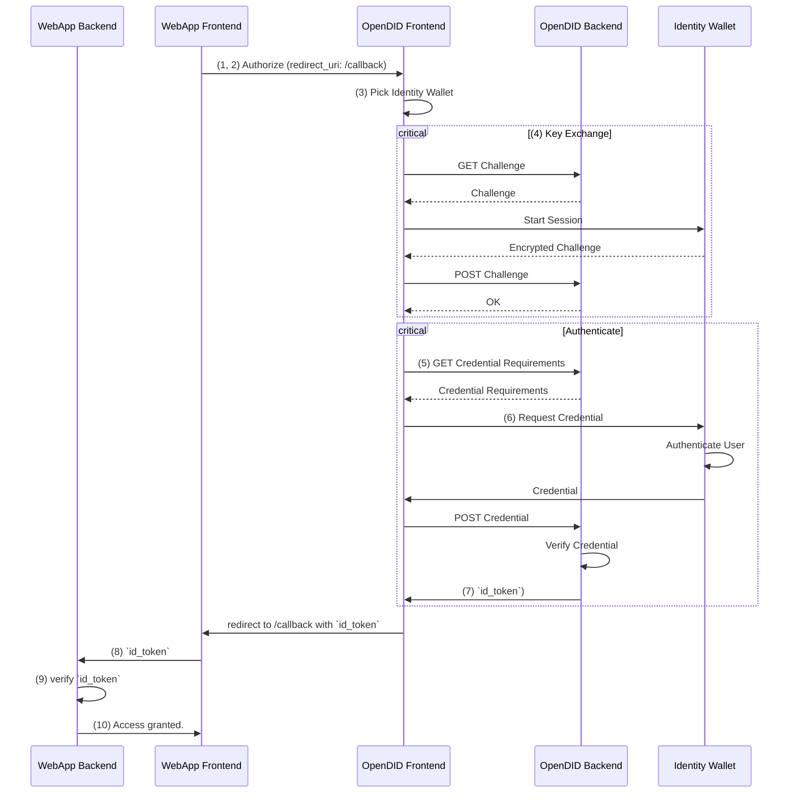

This guide explains the internal workings of OpenDID.
Understanding this flow is helpful for setting up and configuring an OpenDID Service but less important if you only need to integrate it in an application.

OpenDID includes interactions between multiple apps to authenticate and authorize users.
Common use cases include the following:

- Web app Frontend (app that includes the login button, for example, the demo app)
- Web app back end
- OpenDID front end
- OpenDID back end
- Identity wallet (a browser extension, for example, [Sporran](https://www.sporran.org/))

The following steps outline the interactions necessary to implement the Implicit Flow:

1. The user clicks the login button on the *web app front end*.
2. The *web app front end* redirects the user to the *OpenDID front end*.
3. The user chooses what wallet to authenticate with.
4. The *OpenDID back end* establishes a secure session with the *identity wallet*.
5. The *OpenDID back end* optionally requests a credential that implements a specific CType.
6. The *identity wallet* provides the *OpenDID back end* with the requested credential, after authenticating the DID holder.
7. The *OpenDID back end* returns a `id_token` as a JSON web token (JWT) to the *OpenDID front end*.
8. *OpenDID front end* redirects the user back to a specific `redirect_url` on the *web app front end* including the `id_token`.
9. The *web app front end* detects the `id_token` and sends it to the *web app back end*.
10. The *web app back end* verifies the `id_token` and ensures the validity of the credential.

The following sequence diagram summarizes the flow:

:::info
Although this example describes the implicit flow, the authorization code flow is similar.
Instead of returning an `id_token` directly, the OpenDID service instead returns a `code` to exhange for an `id_token` using the `token` endpoint.
:::
