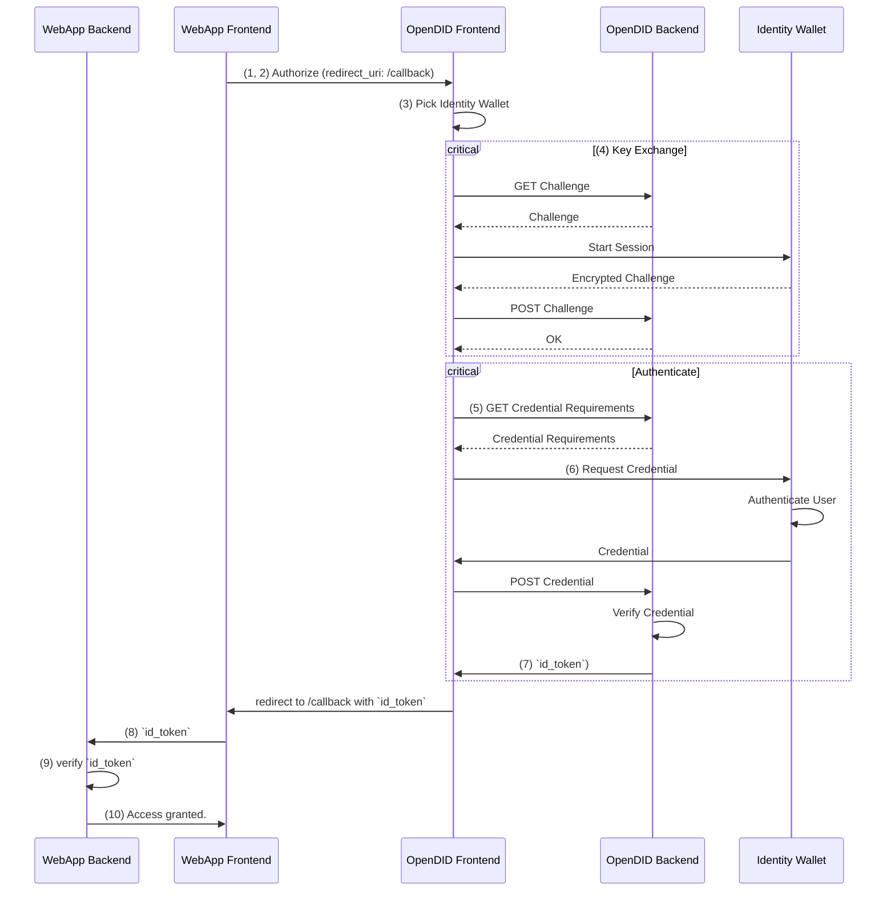

This section explains the internal workings of OpenDID. Understanding this flow is helpful for setting up and
configuring an OpenDID Service but less important if only integrating it in an application is needed.

OpenDID includes interactions between multiple apps in order to authenticate and authorize users, common use cases
inlcude the following programs:

- WebApp Frontend (App that includes the login button e.g. the Demo App)
- WebApp Backend
- OpenDID Frontend
- OpenDID Backend
- Identity Wallet (Browser Extension e.g. [Sporran](https://www.sporran.org/))

The following steps outline the interactions necessary to implement the Implicit Flow:

1. The user clicks the login button on the *WebApp Frontend*
2. The *WebApp Frontend* redirects the user to the *OpenDID Frontend*.
3. The user chooses what wallet to authenticate with.
4. *OpenDID Backend* establishes a secure session with the *Identity Wallet*.
5. *OpenDID Backend* optionally requests a credential that implements a specific CTYPE.
6. *Identity Wallet* provides the *OpenDID Backend* with the requested credential, after authenticating the DID holder.
7. *OpenDID Backend* returns a `id_token` (JWT)  to the *OpenDID Frontend*.
8. *OpenDID Frontend* redirects user back to a specific `redirect_url` on the *WebApp Frontend* includig the `id_token`.
9. The *WebApp Frontend* detects the `id_token` and sends it to the *WebApp Backend*.
10. The *WebApp Backend* verifies the `id_token` and ensures the validity of the credential.

:::note
Although this example describes the Implicit Flow, the Authorization Code Flow is similar. Instead of returning and
`id_token` directly, a `code` is returned by the OpenDID service that can be exchanged afterwards using the `token`
endpoint.
:::
