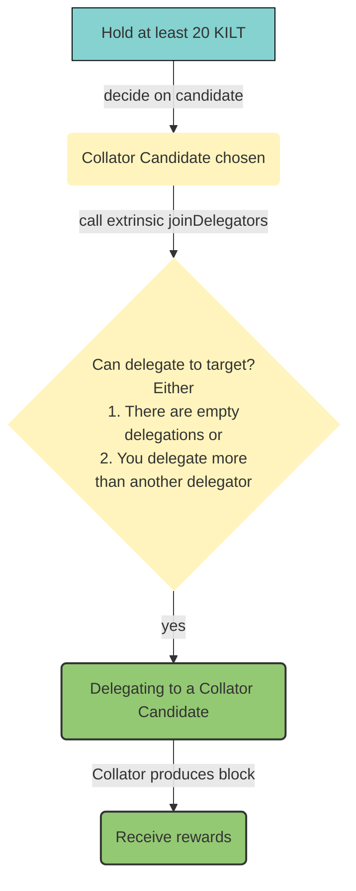
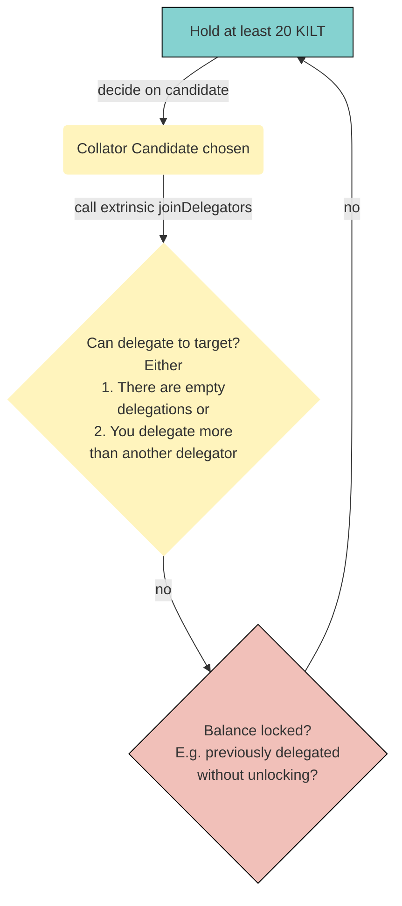
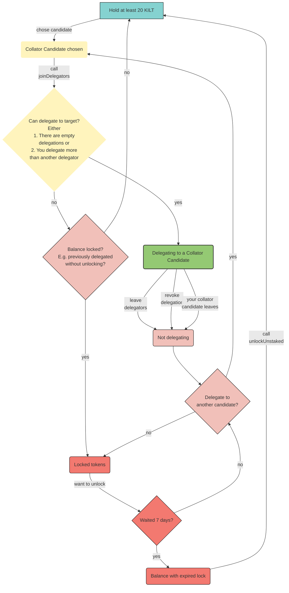

import Tabs from '@theme/Tabs';
import TabItem from '@theme/TabItem';

## How to become a delegator

In contrast to the rather difficult [path to become a collator candidate](./Collator/01_welcome.md), joining the delegator pool is rather simple.
You can either do this in Polkadot JS Apps or the KILT Stakeboard, which serves as an in-house developed Frontend for all KILT staking activity.
Below, we explain how to do it for the former case.
However, the latter option is explained in detail in the [BOTLabs Trusted Entity support hub](https://support.kilt.io/support/solutions/80000442174).

Anyone can delegate to a collator candidate by staking at least 20 KILT and calling `parachainStaking -> joinDelegators`.

In Polkadot JS ([wss://spiritnet.kilt.io](https://polkadot.js.org/apps/?rpc=wss%3A%2F%2Fkilt-rpc.dwellir.com#/explorer), or [wss://peregrine.kilt.io/parachain-public-ws](https://polkadot.js.org/apps/?rpc=wss%3A%2F%2Fperegrine-stg.kilt.io%2Fpara-public-ws#/explorer)) go to `Developer -> Extrinsics -> Submission.`

1. Select the delegator's KILT address as the extrinsic submitter (the *using the selected account* field)
2. Select the appropriate extrinsic: `parachainStaking -> revokeDelegation`
3. Select the `Id` option (the *collator: MultiAddress (LookupSource) field*)
4. Select the collator account (the *Id: AccountId* field)
5. Choose the desired stake amount.
6. Sign and submit the extrinsic.

:::info
A recent change in the blockchain metadata resulted in a change in the UI regarding how balances are shown.
In the current version of PolkadotJS Apps, specifying 1 KILT requires adding 15 trailing `0`s.
So, for instance, 1 KILT needs to be written as `1000000000000000`, while 10,000 KILT would be written as `10000000000000000000`.
:::

### Happy path
If your chosen collator candidate has at least one empty slot in their delegation pool (35 at the time of writing), your delegation is successful and you immediately receive rewards for each authored block of your collator.

:::info
If your chosen collator fails to produce blocks, neither the collator itself nor their delegators receive rewards.
This can happen if they have connectivity issues or are not building blocks fast enough. 
:::

### Unhappy path 

If your collator candidate has a maxed out delegation pool, an upcoming delegator candidate must stake more than the current lowest delegator of that pool.
When that happens,

- The kicked delegator will be replaced by the delegator with a higher delegation immediately
- The kicked delegator's stake is prepared for unstaking as if they revoked the delegation (*see [revoking](#Revoking)*)
- A delegator needs to wait 7 days (in block time) to be able to unlock the stake.
Please note that it can take longer in real time as the block times assumes a constant block time of 12s which is not guaranteed.

<!-- TODO: Link round to Glossary -->
:::info
For now, an account can only delegate to one collator at any time!
Moreover, you can only (re-) delegate once per staking round, e.g. call `parachainStaking -> {joinDelegators, delegateAnotherCandidate}`.
:::

## How to adjust your stake

A delegator can increase and decrease their stake by calling either  `parachainStaking -> delegatorStakeMore(more)` or `parachainStaking -> delegatorStakeLess(less)`.
Your adjustment becomes effective immediately!
In case you increased your stake, you instantly receive higher rewards for any produced blocks of your collator.
However, if you decreased your delegation amount, the reverse applies and you receive less rewards.

 In Polkadot JS ([wss://spiritnet.kilt.io](https://polkadot.js.org/apps/?rpc=wss%3A%2F%2Fkilt-rpc.dwellir.com#/explorer), or [wss://peregrine.kilt.io/parachain-public-ws](https://polkadot.js.org/apps/?rpc=wss%3A%2F%2Fperegrine-stg.kilt.io%2Fpara-public-ws#/explorer)) go to `Developer -> Extrinsics -> Submission`.

<Tabs
  groupId="delegator-adjust-stake"
  defaultValue="Stake more"
>
<TabItem value="Stake more" label="Stake more">

1. Select the delegator's KILT address as the extrinsic submitter (the *using the selected account* field)
2. Select the extrinsic: `parachainStaking -> delegatorStakeMore`
3. Select the `Id` option (the *collator: MultiAddress (LookupSource) field*)
4. Select the collator account (the *Id: AccountId* field)
5. Choose the desired stake amount which you want to add to your current stake.
You can add up to your maximum available balance.
6. Sign and submit the extrinsic

</TabItem>
<TabItem value="Stake less" label="Stake less">

1. Select the delegator's KILT address as the extrinsic submitter (the *using the selected account* field)
2. Select the extrinsic: `parachainStaking -> delegatorStakeLess`
3. Select the `Id` option (the *collator: MultiAddress (LookupSource) field*)
4. Select the collator account (the *Id: AccountId* field)
5. Choose the desired stake amount which you want to remove from your current stake.
You can reduce down to the minimum delegation amount (20 KILT), e.g., any value up to the difference of your current stake and the minimum will be accepted.
6. Sign and submit the extrinsic

</TabItem>
</Tabs>

:::caution
You cannot adjust your stake if your collator candidate is in the leaving state, e.g., they want to stop collating.
However, you can still [revoke](#how-to-revoke-your-delegation) your delegation or [exit](#how-to-exit).
:::

## How to revoke your delegation

You can revoke your delegation at any time by calling `parachainStaking -> revokeDelegation`.
As a result, you won't receive any rewards immediately after the transaction is successful.
- The corresponding amount will be prepared for unstaking.
- You need to wait 7 days (in block time) before you can unlock your unstaked tokens, see [below](#how-to-unlock-unstaked-tokens) for more information.
- Revoking a delegation does not count towards the limit of “1 delegation per round”.

In Polkadot JS ([wss://spiritnet.kilt.io](https://polkadot.js.org/apps/?rpc=wss%3A%2F%2Fkilt-rpc.dwellir.com#/explorer), or [wss://peregrine.kilt.io/parachain-public-ws](https://polkadot.js.org/apps/?rpc=wss%3A%2F%2Fperegrine-stg.kilt.io%2Fpara-public-ws#/explorer)) go to `Developer -> Extrinsics -> Submission.`

1. Select the delegator's KILT address as the extrinsic submitter (the *using the selected account* field)
2. Select the appropriate extrinsic: `parachainStaking -> revokeDelegation`
3. Select the `Id` option (the *collator: MultiAddress (LookupSource) field*)
4. Select the collator account (the *Id: AccountId* field)
5. Sign and submit the extrinsic

:::info
Since you can only delegate to a single collator candidate for now, revoking a single delegation is exactly the same as [exiting](#how-to-exit).
Of course, this will change if the community decides to enable multiple delegations per account.
:::

## How to exit

A delegator can revoke all of their delegations at once by calling `parachainStaking -> leaveDelegators`.
- Your previously delegated amount will be prepared for unstaking.
- You need to wait 7 days (in block time) before you can unlock your unstaked tokens, see [below](#how-to-unlock-unstaked-tokens) for more information.
- Exiting does not count towards the limit of “1 delegation per round”.

1. Select the delegator's KILT address as the extrinsic submitter (the *using the selected account* field)
2. Select the appropriate extrinsic: `parachainStaking -> leaveDelegators`.
3. Sign and submit the extrinsic

:::info
Since you can only delegate to a single collator candidate for now, exiting is exactly the same as [revoking a single delegation](#how-to-revoke-your-delegation).
Of course, this will change if the community decides to enable multiple delegations per account.
:::

## How to unlock unstaked tokens

Before you can unlock your previously staked tokens, you have to wait 7 days (in block time).

1. Select any account with enough balance to cover the transaction fee which is around 0.005 KILT (the *using the selected account* field)
2. Select the appropriate extrinsic: `parachainStaking -> unlockUnstaked(target)`
3. Select the `Id` option (the *collator: MultiAddress (LookupSource) field*)
4. Select the delegator's KILT address (the *Id: AccountId* field)
5. Sign and submit the extrinsic

:::info
Even if you have not exited, reduced or removed your delegation, you can still have unstaked tokens.
This can happen if either of the following events occurred
* You were kicked out of your collator candidate's delegation pool because all current delegators have a higher stake
* Your collator candidate intentionally left the collator pool.
:::

## Lifecycle of a Delegator

The following diagram depicts the full lifecycle of a delegator from owning free KILT to delegating, losing a delegation seat, re-delegating and finally unlocking their stake.

## Troubleshooting

### Rewards have stopped

If you have stopped to receive rewards, either
1. You were kicked out of your collator candidate's delegation pool because all current delegators have a higher stake or
2. Your collator candidate stopped producing blocks, because they...
   1. Left the collator candidate pool intentionally such that they don't have an associated collator state on-chain henceforth; or
   2. Are not among the top staked candidates (of which are 30 at the time of writing 2022-05-05); or
   3. Are offline.

In case of 1. or 2i., your stake will automatically be unstaked and prepared for [unlocking](#how-to-unlock-unstaked-tokens).
Otherwise, in case of 2ii. and 2iii., you need to [manually initiate the unlocking period](#how-to-exit) if you don't want to/cannot delegate to another collator candidate.

<!-- TODO: Move to Staking Troubleshooting once it exists -->
### Why can't I transfer unstaked tokens?

Staking puts a lock on your tokens which blocks them from being transferred.
You can still use them for participating in Governance.
If your funds are unstaked, you still need to wait 7 days (in block time) to [unlock tokens after unstaking them](#how-to-unlock-unstaked-tokens).
