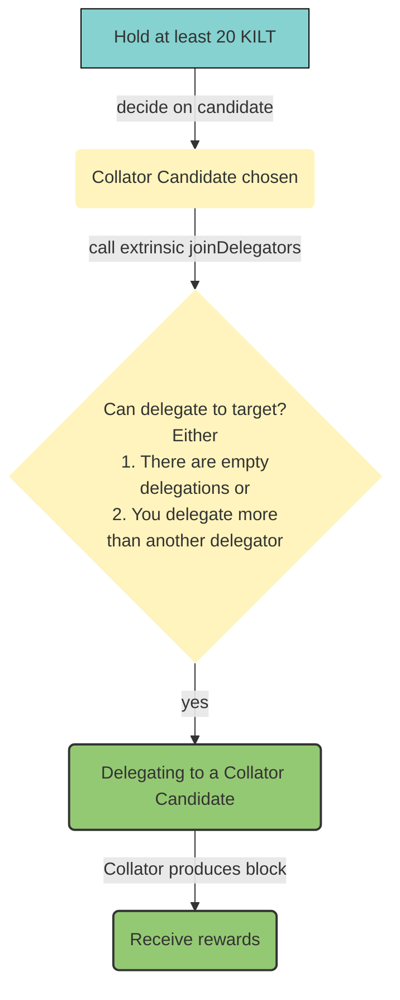
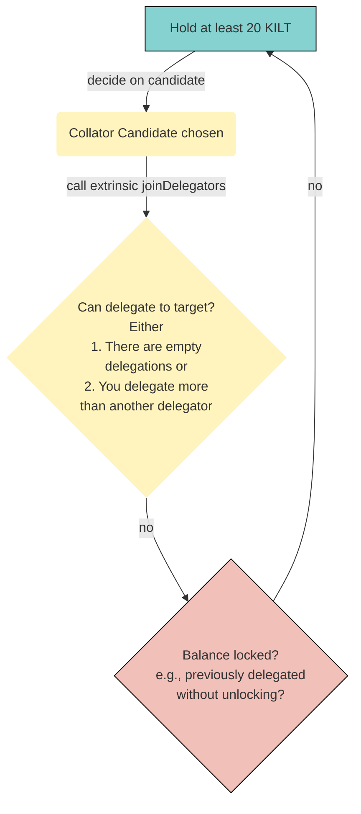

import Tabs from '@theme/Tabs';
import TabItem from '@theme/TabItem';
import StakingTxDisclaimer from '../_disclaimer_staking_tx.md';

In contrast to the rather difficult [path to become a collator candidate](../01_become_a_collator/01_overview.md), joining the delegator pool is rather simple.
Anyone can delegate to a collator candidate by staking at least 20 KILT and calling `parachainStaking -> joinDelegators`.

<StakingTxDisclaimer />

1. Select the delegator's KILT address as the extrinsic submitter (the *using the selected account* field)
2. Select the appropriate extrinsic: `parachainStaking -> revokeDelegation`
3. Select the `Id` option (the *MultiAddress (LookupSource) field*)
4. Select the collator account (the *Id: AccountId* field)
5. Choose the desired stake amount.
6. Sign and submit the extrinsic (the *Submit Transaction* button)

:::info
A recent change in the blockchain metadata resulted in a change in the UI regarding how balances are shown.
In the current version of PolkadotJS Apps, specifying 1 KILT requires adding 15 trailing `0`s.
So, for instance, 1 KILT needs to be written as `1,000,000,000,000,000`, while 10,000 KILT would be written as `10,000,000,000,000,000,000`.
:::

## Happy path
If your chosen collator candidate has at least one empty slot in their delegation pool (out of 35 maximum slots at the time of writing), your delegation is successful and you immediately start receiving rewards each time the collator you delegated will produce a block.

:::info
If your chosen collator fails to produce blocks, neither the collator itself nor their delegators receive rewards.
This can happen if they have connectivity issues or are not building blocks fast enough. 
:::

## Unhappy path 

If your collator candidate has a maxed out delegation pool, an upcoming delegator candidate must stake more than the current lowest delegator of that pool.
When that happens,

- The kicked delegator will be replaced by the delegator with a higher delegation immediately
- The kicked delegator's stake is prepared for unstaking as if they revoked the delegation (*see [revoking](#Revoking)*)
- A delegator needs to wait 7 days (in block time) to be able to unlock the stake.
Please note that it can take longer in real time as the block times assumes a constant block time of 12s which is not guaranteed.

<!-- TODO: Link round to Glossary -->
:::info
For now, an account can only delegate to one collator at any time!
Moreover, you can only (re-) delegate once per staking round, e.g., call `parachainStaking -> {joinDelegators, delegateAnotherCandidate}`.
:::
