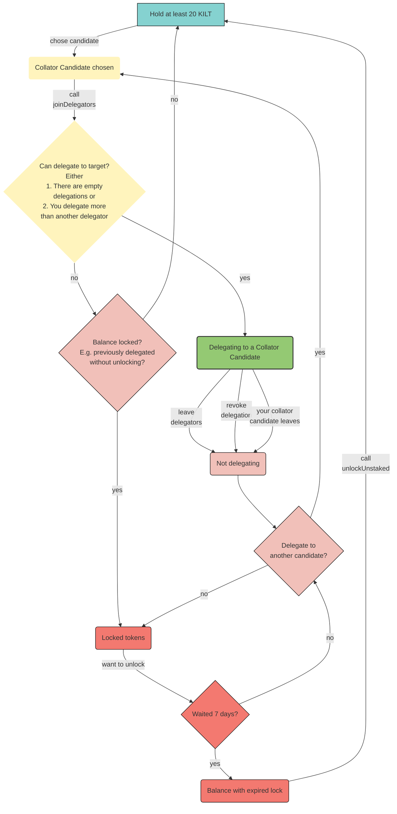

The following diagram depicts the full lifecycle of a delegator from owning free KILT to delegating, losing a delegation seat, re-delegating and finally unlocking their stake.

It summarizes all previous sections.
Thus, in case you are looking for more detailed information, please head back.

