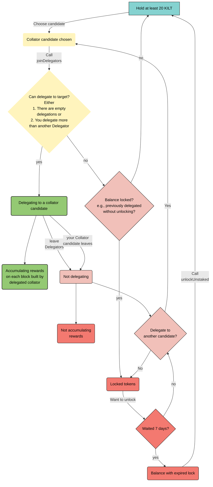

The following diagram depicts the full lifecycle of a delegator from owning free KILT to delegating, losing a delegation seat, re-delegating and finally unlocking their stake.

It provides a summary of the detailed information provided in the preceding sections.

