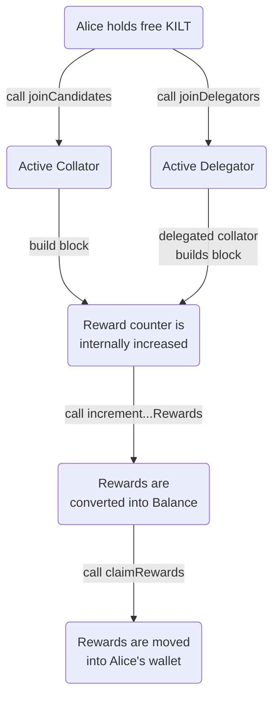

import CodeBlock from '@theme/CodeBlock';
import Tabs from '@theme/Tabs';
import TabItem from '@theme/TabItem';
import StakingTxDisclaimer from './_disclaimer_staking_tx.md';
import GetUnclaimedStakingRewards from '!!raw-loader!@site/code_examples/staking/rewards/01_query_staking_rewards.ts';
import ClaimRewardsCollator from './_04_claim_rewards_collator.mdx';
import ClaimRewardsDelegator from './_04_claim_rewards_delegator.mdx';

Until runtime version 1.7.5 (`spiritnet-10750`), staking rewards were automatically minted.
In 1.8.0 (`spiritnet-10801`) this will change:
Hereafter, the rewards are still accounted to the collators and their delegators in each block.
However, they need to be actively claimed by calling an extrinsic, similar to the pull-based approach on Polkadot.
Since the rewards never expire, one does not need to rush to do so.

This change improves the scalability of our LDPoS by orders of magnitude because it removes the `Rewarded` events for a collator and all their delegators in each block.
This reduces the number of taxable events from many thousands per year to any number a user might find suitable.
Please check our blogpost for more details.

## How to check the reward amount

Unfortunately, the amount of accumulated rewards are not directly stored on the chain but divided into multiple storage entries.
Luckily, you can easily query your current reward status by performing a runtime API call which we created for that specific purpose.
Since this is just a simple query, it does not cost any transaction fees.

<Tabs
  groupId="rewards-apps-code"
  defaultValue="polkadot-apps"
>
<TabItem value="polkadot-apps" label="Polkadot Apps">

In the Polkadot JS Apps ([wss://spiritnet.kilt.io](https://polkadot.js.org/apps/?rpc=wss%3A%2F%2Fkilt-rpc.dwellir.com#/explorer), or [wss://peregrine.kilt.io/parachain-public-ws](https://polkadot.js.org/apps/?rpc=wss%3A%2F%2Fperegrine-stg.kilt.io%2Fpara-public-ws#/explorer)) go to `Developer -> Runtime calls`. 

1. Select the `parachainStaking` endpoint.
2. Select the `getUnclaimedStakingRewards(account)` call.
3. Select your KILT address (the *account: AccountId32* field)
4. Submit the runtime call (the *Submit Runtime call* button). You do not need to sign or pay any fees.

</TabItem>

<TabItem value="polkadot-js" label="Polkadot JS">
    <CodeBlock className="language-ts">
        {GetUnclaimedStakingRewards}
    </CodeBlock>
</TabItem>
</Tabs>

## How to claim

In order to move the staking rewards into your wallet, you need to call two different extrinsics: `increment{Collator, Delegator}Rewards` and `claimRewards`.
This can be done sequentially or in a batch.
To save transaction fees, we recommend the latter [batched call](#recommendation-batched-call).

<StakingTxDisclaimer />

<Tabs
  groupId="collator-delegator"
  defaultValue="Collator"
>
<TabItem value="Collator" label="Collator">

<ClaimRewardsCollator />

</TabItem>

<TabItem value="Delegator" label="Delegator">

<ClaimRewardsDelegator />

</TabItem>
</Tabs>

## Runtime API

