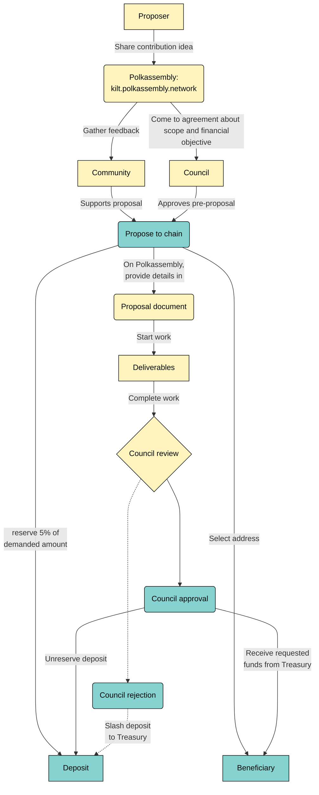

Complete these steps to create a well-formed Treasury proposal.

## Discuss

The first step in applying for a Treasury grant is either to join the community in the [Discord Treasury Channel](https://discord.gg/nUpqDfQ6kJ) to brainstorm the scope of your proposal intention or immediately open a discussion on [Polkassembly](https://kilt.polkassembly.network/discussions).
This will help you get valuable community feedback throughout the process.
It also gives Council members an open and transparent way to measure community sentiment.

When submitting for discussion, it is best practice to include a proposal document.
[A reference document](https://docs.google.com/document/d/1nz5GNjTL5inaI5s9djIki7DUp5zyPJV9dEI9K06kJ58/edit) can be found in the KILT Protocol discussions this can be used as a template for future proposals.

## DID Sign

The proposed document MUST be DID signed.
This requires a DID that MUST be associated with the proposal.
Therefore, it requires the proposer to have a DID.
The signature provides integrity and accountability for the submitter, which can give more confidence to the community and council.

The DID Signature should be done via [DIDSign](https://didsign.io/) a dApp which is built on KILT.
The DIDSign doesn't have a database, nor store any data by the user.
The following guide provides a how to create a signature using a DID with DIDSign.

Once the document has been signed and a link can be added to the proposal so others can verify.
This MUST include the document and signature.
The method of storing the document and the signature can vary, however, we recommend using IPFS or an equivelant such as Crust.
The document can be retrieved easily can be verified by anyone with a DID.

Please include how to verify and download the necessary documents.
The following is an example done by BOTLabs GmbH.

```md
## How to verify the document integrity

The current version of the proposal document has been digitally signed with one of the DIDs that BOTLabs GmbH controls. To verify the signature:

1. Download the PDF version of the Google Document linked above.

2. Download the DID signature of the file from IPFS, with CID QmRcYyPcCKGDQno2m5qBSZq7dftoZKuwraF9C9M96rXR36 (e.g., ipfs.io).

3. Visit didsign.io, and upload both the PDF file and the downloaded signature. The signature should verify correctly and link to the KILT tx in which the timestamp was generated.

4. To verify the back-link from the DID to the account to which the funds must be sent if the Proposal is accepted, copy the account in the Proposal (15oXzySe6tjF2MumHfUodH8pFQWjy2hraRmXUJXXMKKY6p3F for quick reference) and paste it in w3n.id. The account must be linked to the same web3name that signed the proposal document.
```

The example may change depending on the method of storing and creation of the document.

If during the discussion the document is edited it will require a new upload and should be updated accordingly.

## Deposit

A deposit of 5% of the amount requested is required in order to submit a proposal.
If the proposal is denied, you will lose this amount and it will go to the Treasury to fund other projects.
This is why it is essential to engage with the community and show how the proposed work adds value to the network.

## Create Proposal

To maximize your chances of success, create a full proposal document with as much information as possible to communicate the value of your work and what it will add to the network’s growth and success.
Check out our Treasury proposal template or Polkassembly’s [proposal document #6](https://docs.google.com/document/d/1NilDtFljCc6boyHkz2o2kGyFNhR6hVQSGzz7J0Xhwco/edit) as examples to help guide your process.

Multiple types of proposals can be created covering building and infrastructure, outreach and hackathons, or [educational content](04_content_creation_guidelines.md) such as videos, blogs and translations.

Once your proposal document is complete, upload it so that it’s accessible to the Council for review.
Don’t forget to link it when completing the Polkassembly information!

## Submit Proposal

When you have feedback from the community and are satisfied with your proposal, head to [Polkadot.JS apps](https://polkadot.js.org/apps/?rpc=wss://spiritnet.api.onfinality.io/public-ws#/treasury)

Scroll to  the “+ Submit Proposal” button and click.
Complete the form:

* Submit with Account: this is the account that will make the 5% deposit
* Beneficiary: this is the account that will receive Treasury funding if successful
* Value: this is the full amount of KILT being requested
* Click submit to complete the proposal

## Polkassembly Details

Click the [Polkassembly](https://kilt.polkassembly.network/discussions) link to the right of the proposal on Polkadot.JS and connect with the account that you used to submit the proposal in order to be able to edit the proposal details.

Enter the following information:

* Title: a title for your project
* Purpose: what’s your motivation behind the effort
* Description: a short summary about you, the project and the need for what you are proposing
* Full Proposal: link to the full proposal
* Proposal Amount: the amount requested in USD
* KILT Rate: the current rate of exchange in USD
* Amount Requested: the total amount of KILT requested
* Beneficiary: the beneficiary address
* Period: intended date of delivery if applicable
* Contact: email or social handle (please specify social network)
* Engage
* Share your proposal in our channels to generate support from community and showcase your project (Discord, Telegram, Element, Twitter)

Click [here](https://www.kilt.io/treasury/overview/) to get an overview of the Treasury.
Or click [here](https://www.kilt.io/treasury/content-creation/) to see the guidelines for content creation.

## Illustration

The following diagram depicts the flow of a Treasury proposal from having an idea to receiving the funds in the beneficiary address.
While all nodes with yellow background represent <span style={{backgroundColor: "#FFF4BD", color: "black"}}>off-chain processes</span>, the remaining ones involve <span style={{backgroundColor: "#85D2D0", color: "black"}}>on-chain activity</span>.

<div class="kilt-mermaid">



</div>
