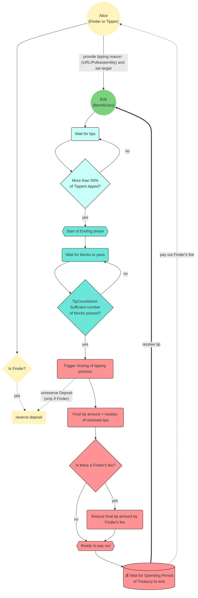

Similar to [opening a Treasury proposal](./03_treasury_proposal.md), anyone can start a tipping process.
Of course, success of such can only be expected if it is based on a meaningful contribution.
The variety of potential contributions is vast, please see our [Contribution guide](../develop/06_contribute.md) for more details.
There, you will also find a high level description of tips and the differences to Treasury proposals.

In the following, we will lead you through the necessary steps from requesting a tip to finally receiving it.

## Lifecycle of a tipping process

Since anyone propose as tip, you can certainly do that for someone else, the **Beneficiary**, as well.
In that case, you, the **Finder**, will receive a **share of 20% of the final tip** if it is successful.
However, you also need to make a **minor deposit** which is dependent of the number of characters you provide for the reason.
Overall, you should expect between 0.05 to 0.2 KILT as deposit.
E.g., if you provide a URL which includes 60 characters, the deposit is expected to be around 0.07 KILT.

After proposing a tip, the KILT Council and a few other core contributors come to consensus on how much should be paid.
Every member of this stakeholder group, the **Tippers**, can submit an appropriate amount.
Eventually, the median of all tips is taken as the final amount.

Once at least half of the Tippers have declared their tip, the ending phase starts.
After 24 hours in blocktime have passed, the tip is automatically closed and paid from the Treasury.
However, other Tippers can still submit their suitable amount and thus influence the final amount of the tip.
During payout, 20% of the tip is given to the Finder, as well as returning the deposit.
Albeit if the Finder is a member of the Tippers, the entire tip goes to the Beneficiary.

## Report awesome

Proposing a tip much is simpler than opening a Treasury proposal.

<!-- TODO: Replace with images from Spiritnet, once it is live -->

All you need to do is navigate to `Governance > Treasury > Tips` and hit the `+ Propose tip` button.

1. Select your corresponding account as the extrinsic submitter (the *submit with account* field)
2. Provide the address you consider worthy of receiving a tip: (the *beneficiary* field)
3. Provide a reason (the *tip reason* field). This can either be some **descriptive words or a URL**. The latter should point to the contribution(s), e.g., the github pull request, blog posts, translations or videos among other things. Please note that the tipping process is expected to fail if the reason is not recognizable.
4. Sign and submit the extrinsic (the *Propose tip* button)

## Example

Since tipping is a default Substrate feature which exists on Kusama and Polkadot among others, please have a look at the [Polkadot Wiki](https://wiki.polkadot.network/docs/learn-treasury#tipping) for a thorough example.
