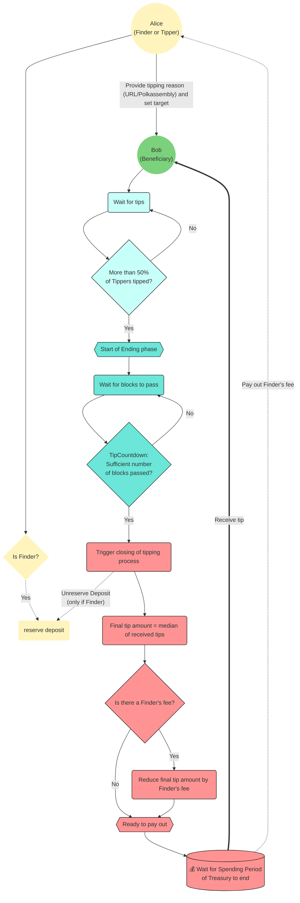

Similar to [opening a Treasury proposal](./03_treasury_proposal.md), anyone can start a tipping process.
Of course, success of such can only be expected if it is based on a meaningful contribution.
The variety of potential contributions is vast, please see our [Contribution guide](../develop/06_contribute.md) for more details.
There, you will also find a high level description of tips and the differences to Treasury proposals.

In the following, we will lead you through the necessary steps from requesting a tip to finally receiving it.

## Lifecycle of a Tipping Process

Since anyone can propose a tip, you can certainly do that for someone else, the **Beneficiary**.
In that case, you, the **Finder**, will need to put down a **minor deposit**, which depends on how long the "reason of the tip message" is, meaning how many characters form the reason why the tipping is being proposed.
Overall, you should expect to provide **between 0.05 to 0.2 KILT** as a deposit.
For example, if you provide a URL that includes 60 characters, the deposit would be around 0.07 KILT.

After a tip proposal is made, the set of tippers, which is elected by the KILT Council, come to consensus on how much should be paid.
Every member of this stakeholder group, the **Tippers**, can submit an appropriate amount.
Eventually, the median of all tips is taken as the final amount.

Once at least half of the Tippers have declared their tip, the ending phase starts.
After 24 hours have passed, the tip is automatically closed and paid from the Treasury.
However, other Tippers can still submit their suitable amount and thus influence the final amount of the tip.
After payout, the original deposit is returned to the Finder.
The proposal will not be approved and paid out until at least half the tippers have voted with `Aye`. At any point before it is approved, the Finder can cancel the tip proposal and get back their deposit.

:::note No Finder's fees
While tipping allows a configurable percentage of the final tip to go to the original Finder, the current KILT configuration has set this fee to 0, meaning that the Finder's will thus not get rewarded for successful tips.
:::

## Report Awesome

Proposing a tip much is simpler than opening a Treasury proposal.

<!-- TODO: Replace with images from Spiritnet, once it is live -->

All you need to do is navigate to `Governance > Treasury > Tips` and hit the `+ Propose tip` button.

1. Select your corresponding account as the extrinsic submitter (the *submit with account* field)
2. Provide the address you consider worthy of receiving a tip: (the *beneficiary* field)
3. Provide a reason (the *tip reason* field). This can either be some **descriptive words or a URL**. The latter should point to the contribution(s), e.g., the GitHub pull request, blog posts, translations or videos among other things. Please note that the tipping process is expected to fail if the reason is not recognizable.
4. Sign and submit the extrinsic (the *Propose tip* button)

## Example

Since tipping is a default Substrate feature which exists on Kusama and Polkadot among others, please have a look at the [Polkadot Wiki](https://wiki.polkadot.network/docs/learn-treasury#tipping) for a thorough example.
