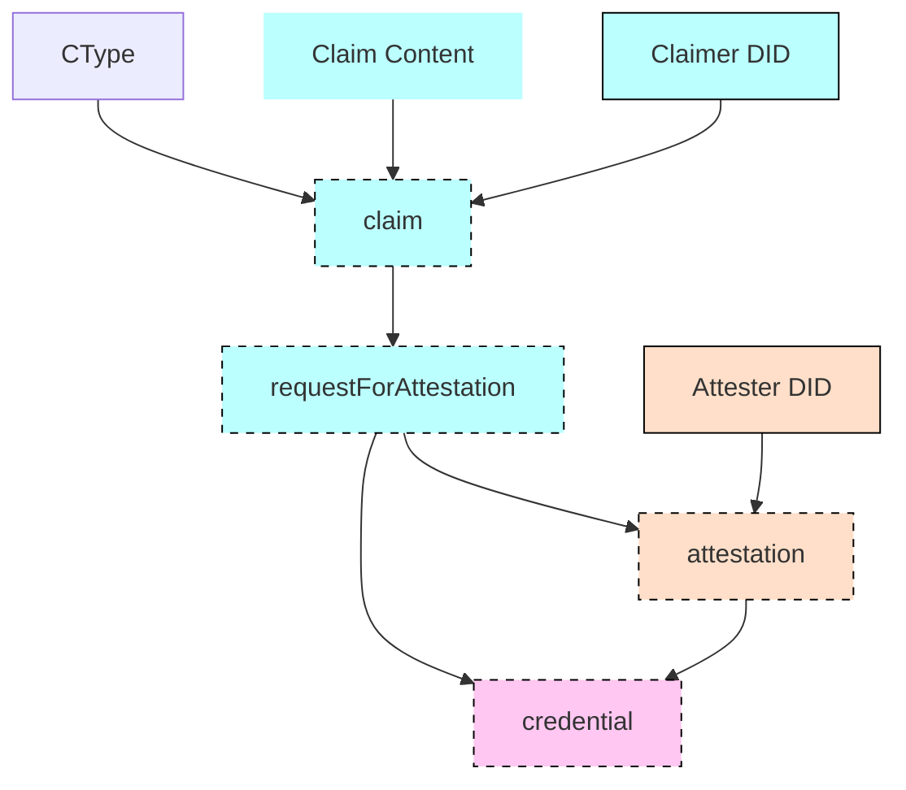

In this tutorial, we'll run through the full story of a claim.

To do so, three actors will be involved: a Claimer, an Attester and a Verifier.
You'll be playing all three roles. In the real world, these actors would be running different services, so we set up different folders to mimic this separation.

These three actors will be exchanging various objects.
The most important one is the `credential`.
This is how a `credential` is created:

That's a mouthful, but don't worry - we'll dig deeper into the elements of this diagram in the next steps! For now, just keep in mind:

- A credential has a certain type (CType);
- Obtaining a credential is a multiple-step process that involves a Claimer - such as a citizen who makes a claim about themselves - and an Attester - such as a government agency that certifies this claim. A Verifier - such as a government officer - will later on check the validity of the credential.

OK, let's start by generating KILT Attester account, and then we'll go on and create a claim.
