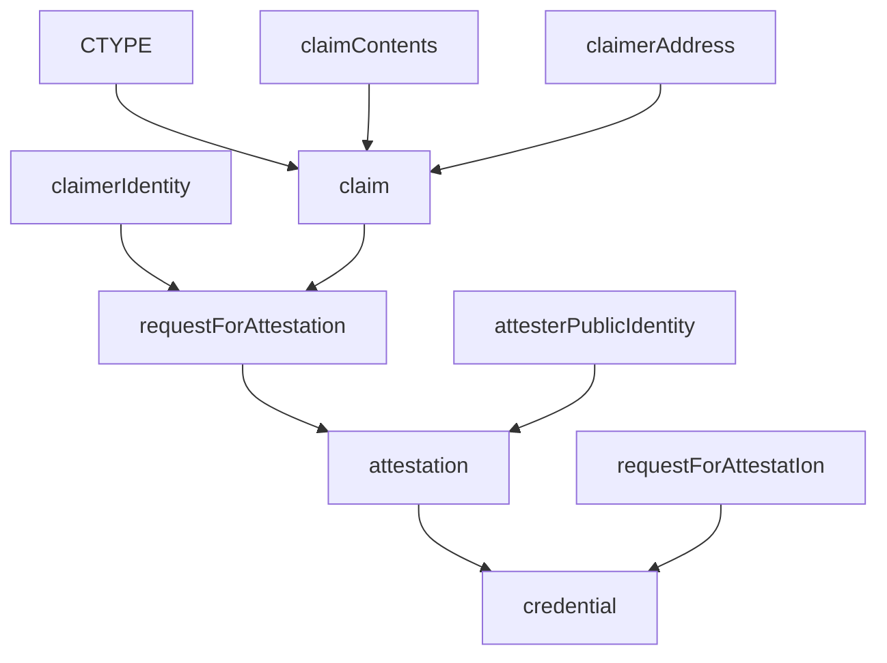

In this tutorial, we'll run through the full story of a claim.

To do so, three actors will be involved: a claimer, an attester and a verifier. You'll be playing all three roles (unless you're in a KILT workshop and different participants are playing different roles).

These three actors will be exchanging various objects; the most important one is the `credential`.
This is how an `credential` is created:

That's a mouthful, but don't worry - we'll dig deeper in the elements of this diagram in the next steps! For now, just keep in mind:

- A credential has a certain type (CTYPE);
- Obtaining a credential is a multiple-step process that involves a claimer - such as a citizen who makes a claim about themselves - and an attester - such as a government agency that certifies this claim. A verifier - such as a government officer - will later on check the validity of the credential.

OK, let's start by generating KILT identities, and then we'll go on and create a claim.
