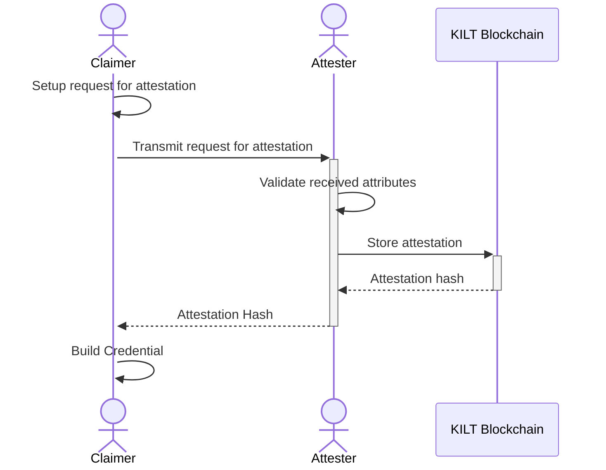
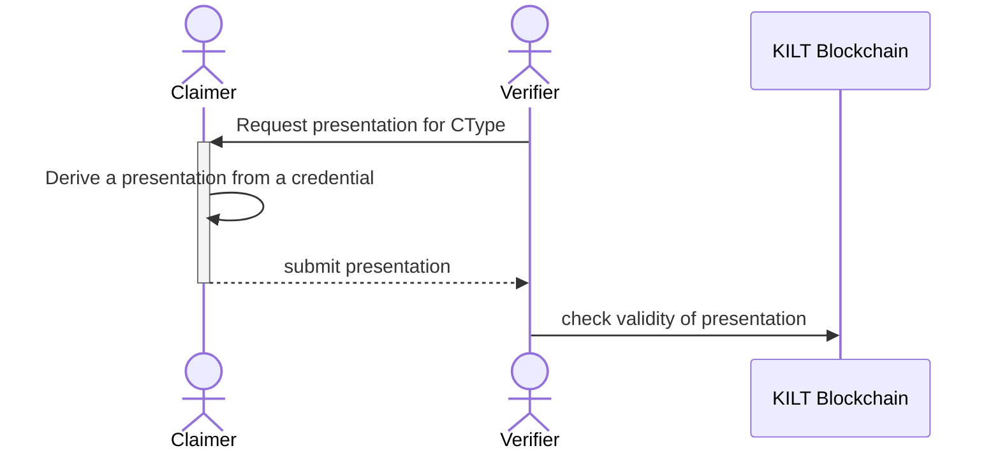

In this tutorial, we'll run through the full story of a claim.

To do so, three actors will be involved: a Claimer, an Attester and a Verifier.
You'll be playing all three roles. In the real world, these actors would be running different services, so we set up different folders to mimic this separation.

Both the Verifier and the Attester have to interact with the KILT blockchain.
But only the Attester is required to own KILTs since they have to pay for storing attestation on chain.
The Verifier only needs to query the KILT blockchain to ensure that the attestation is still valid and was not revoked.
The Claimer is not required to query the blockchain, but they might do so to check whether their credential is still valid or the attester has revoked it in the meantime.

## Request an Attestation

Before the Claimer can receive an attestation, they need to generate a [light DID](../0-core-feature/0_did.md#light-dids), which they can do completely off-chain.
The Attester has to register their DID on chain and therefore needs KILT coins.

After both the Attester as well as the Claimer have set up their identities, the Claimer can start the attestation process by requesting an attestation from the Attester.

## Verify an Attestation

The Verifier requests a presentation from the  Claimer for a specific CType.
Without a specific CType, the presentation is meaningless.
Thus, it is important to require this.
We will [explain CTypes in more detail](attester/ctype) in a later chapter.
A presentation is derived from a credential and does not need to contain all attributes.
A Claimer could choose to hide their address from their passport if the Verifier is only interested in their age.

