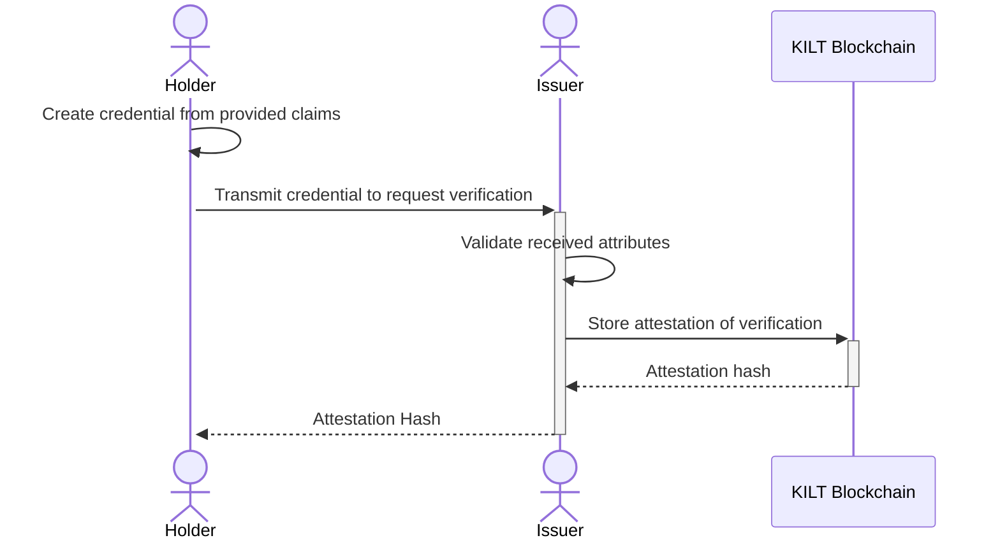
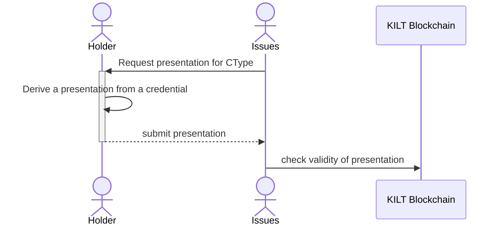

This tutorial runs through the full story of a claim.

It involves four roles which work together to create **distributed trust**:

-   A Holder claims to possess certain credentials, abilities, or other attributes.
-   An Issuer verifies the claims of a Holder.
-   A Verifier asks for proof of a claim.
-   Submitter accounts handles and pays for submitting transactions.

In a real-world use case, these roles could be different people and services, which this workshop simulates using different folders and functions for each service or actor.

Each actor typically performs different roles:

-   Both the Holder and the Issuer have to interact with the KILT blockchain.
-   Only the Issuer has to own KILTs since they have to pay for storing the attestation on chain.
-   The Verifier only needs to query the KILT blockchain to check that the attestation is still valid and wasn't revoked.
-   The Holder isn't required to query the blockchain, but they might do so to check whether their credential is still valid or if the Issuer has revoked it in the meantime.

## Issue a credential

The Holder has to register their DID on chain and needs KILT coins.

After both the Holder and the Issuer have set up their identities, the Holder can start the attestation process by requesting an attestation from the Issuer.

<!-- TODO: Correct diagrams -->

1. The Holder prepares the Credential to verify, along with some proof, for example, a bank statement and ID.
2. They send the document to the Issuer for verification.
3. Upon receiving the credential, the Issuer decides whether the claim is valid by examining the proofs. If the Issuer trusts the claim, they store the attestation document's hash value on the chain, which is a non-functional copy of the document.
4. The Issuer sends this hash value to the Holder, which represents verification of a document.

## Create a presentation

The Verifier requests a presentation from the Holder for a specific required CType. Without a specific CType, the presentation is meaningless.

A presentation is derived from a credential and doesn't need to contain all attributes.

After the request, the Holder can choose to hide elements of their credentials that aren't relevant to the claim.
For example, hide their address from their ID if the Issuer is only interested in their age.

<!-- TODO: verify? -->

### Example: Requesting a travel visa

To take an example of applying for a travel visa:

1. The Embassy (analogous to the Issuer) asks a traveler (analogous to the Holder) for a specific document or CType. For example, it could be a bank statement. The Embassy asks, "Provide proof of financial stability, and we'll grant you a visa." The traveler gets the bank statement from their bank, gets it attested by the bank (The Issuer), and prepares the document.
2. The document is ready, but the Embassy doesn't need all the information in the document. The embassy wants to know if a traveler has sufficient funds, but they don't need to know any transaction details. The traveler redacts or hides these details while presenting.
3. The traveler presents the document to the embassy.
4. The embassy verified the document's authenticity by comparing its hash value with the one on their internal system or a decentralized ledger.
5. Since they trust the Issuer (in this case, the bank that attested the bank statement), they approved the visa application.

:::tip Summary

As you can see, the Embassy didn't need to trust the Holder directly in this system.
They trust the Holder, whom they had previously worked with, or respect due to their position.
And with that trust, they grant the visa with no knowledge of what the Holder has used the credential for.
Even though this process emerged due to the trust in the Issuer, the Issuer wasn't involved in the second stage, so they were unaware of it.
Privacy was achieved with distributed trust.

:::
