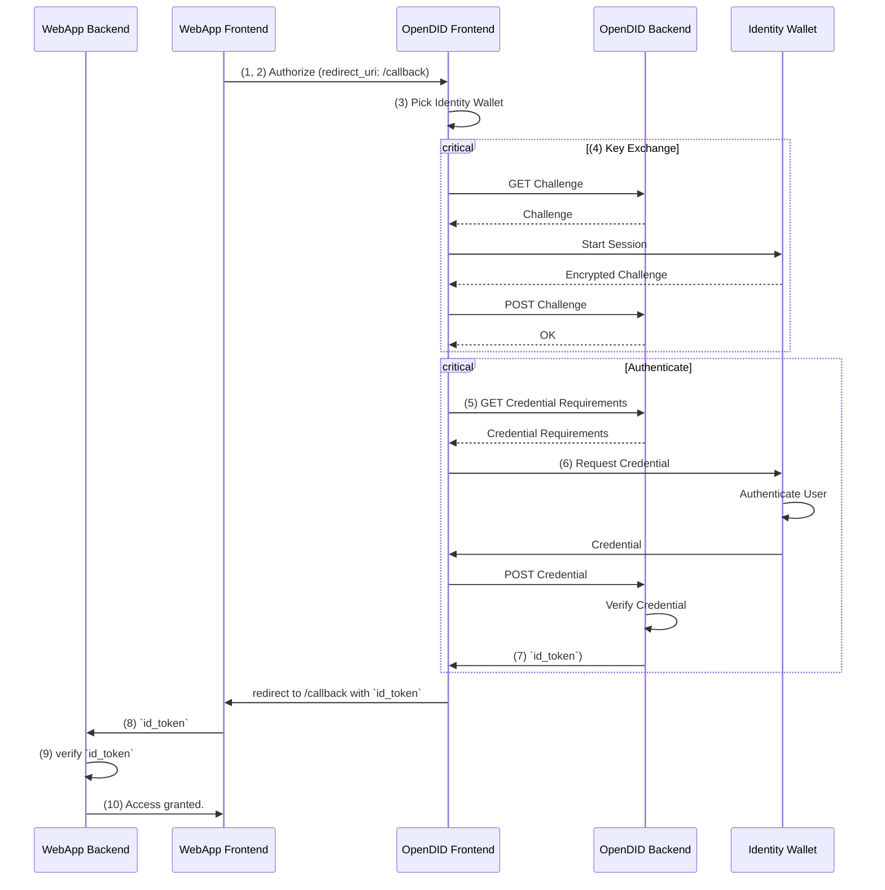

This guide explains the internal workings of OpenDID.
Understanding this flow is helpful for setting up and configuring an OpenDID Service but less important if you only need to integrate it in an application.

OpenDID includes interactions between multiple apps to authenticate and authorize users.
Common use cases include the following:

-   Web app front end (app that includes the login button, for example, the demo app)
-   Web app back end
-   OpenDID front end
-   OpenDID back end
-   Identity wallet that follows [the Credential API spec](https://github.com/KILTprotocol/spec-ext-credential-api) (typically a browser extension, for example, [Sporran](https://www.sporran.org/))

The following steps outline the interactions necessary to implement [the implicit flow](https://openid.net/specs/openid-connect-core-1_0.html#ImplicitFlowAuth):

1. The user clicks the login button on the _web app front end_.
2. The _web app front end_ redirects the user to the _OpenDID front end_.
3. The user chooses what wallet to authenticate with.
4. The _OpenDID back end_ establishes a secure session with the _identity wallet_.
5. The _OpenDID back end_ optionally requests a credential that implements a specific CType.
6. The _identity wallet_ provides the _OpenDID back end_ with the requested credential, after authenticating the DID holder.
7. The _OpenDID back end_ returns a `id_token` as a JSON web token (JWT) to the _OpenDID front end_.
8. _OpenDID front end_ redirects the user back to a specific `redirect_url` on the _web app front end_ including the `id_token`.
9. The _web app front end_ detects the `id_token` and sends it to the _web app back end_.
10. The _web app back end_ verifies the `id_token` and ensures the validity of the credential.

The following sequence diagram summarizes the flow:

:::info
Although this example describes the implicit flow, [the authorization code flow](https://openid.net/specs/openid-connect-core-1_0.html#CodeFlowAuth) is similar.
Instead of returning an `id_token` directly, the OpenDID service instead returns a `code` to exchange for an `id_token` using the `token` endpoint.
:::
