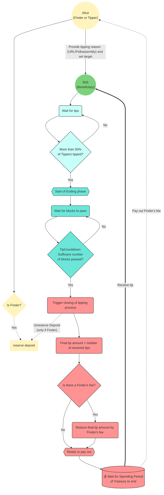

Similar to [opening a Treasury proposal](./03_treasury_proposal.md), anyone can start a tipping process.

You can expect success if the tip is based on a meaningful contribution.
The variety of potential contributions is vast, read the [KILT Contribution guide](../develop/06_contribute.md) for a high level description of tips and the differences to Treasury proposals.

This document covers the necessary steps from requesting a tip to receiving it.

## Lifecycle of a tipping process

Anyone can propose a tip, including for someone else, the **Beneficiary**.
In this case, you, the **Finder**, need to put down a **minor deposit**, which depends on the length in characters of the reason for the tip.
Overall, you should expect to provide **between 0.05 to 0.2 KILT** as a deposit.
For example, if you provide a URL that includes 60 characters, the deposit would be around 0.07 KILT.

After making a tip proposal, the set of tippers, elected by the KILT Council, come to consensus on how much to pay.
Every member of this stakeholder group, the **Tippers**, can submit an appropriate amount.
Eventually, the median of all tips is taken as the final amount.

Once at least half of the Tippers have declared their tip, the ending phase starts.
After 24 hours have passed, the tip is automatically closed and paid from the Treasury.
However, other Tippers can still submit their suitable amount and thus influence the final amount of the tip.
After payout, the original deposit is returned to the Finder.
The Tippers will not approve the proposal and pay it out until at least half the tippers have voted with `Aye`. At any point before the tip is approved, the Finder can cancel the tip proposal and get back their deposit.

:::note No Finder's fees
While tipping allows a configurable percentage of the final tip to go to the original Finder, the current KILT configuration has set this fee to 0, meaning that the Finder's will not get rewarded for successful tips.
:::

## Proposing a tip

Proposing a tip much is simpler than opening a Treasury proposal.

From [polkadot.js.org/apps](https://polkadot.js.org/apps), open _Governance > Treasury > Tips_ and click the _+ Propose tip_ button.

1. Select your account as the extrinsic submitter in the _submit with account_ field
2. Provide the address to receive the tip in the _beneficiary_ field
3. Provide a reason in the _tip reason_ field. This can either be some **descriptive words or a URL**. The _tip reason_ field should point to the contribution(s), e.g., the GitHub pull request, blog posts, translations or videos among other things. The tipping process will fail if the reason is not recognizable.
4. Sign and submit the extrinsic with the _Propose tip_ button